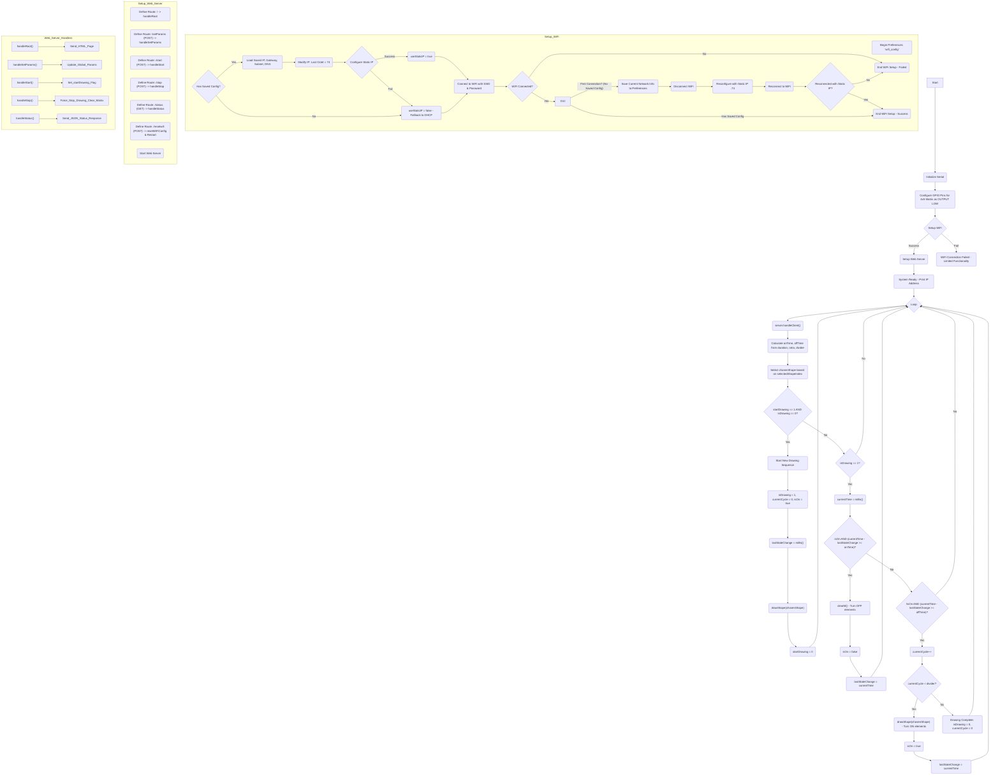

# The ESP32 Thermal Tactile Display Controller

## The notes and the flowchart

### Description of the ESP32 Thermal Tactile Display Firmware

This firmware transforms an ESP32 microcontroller into a standalone controller for a 4x5 thermal tactile display. The system allows users to interact with and control the display through a web interface hosted by the ESP32 itself.


**1. Core Functionality:**

*   **Thermal Matrix Control:** The firmware directly controls a 4x5 matrix of thermal elements. Each element is mapped to a specific GPIO pin on the ESP32. The code defines several pre-set 2D patterns (e.g., Rectangle, Circle, Triangle) that represent which elements in the matrix should be activated to form a shape.
*   **Pulsed Activation:** Instead of continuous activation, shapes are "drawn" by pulsing the corresponding thermal elements ON and OFF for a user-defined number of cycles. This is intended to create a noticeable thermal sensation.
*   **Web-Based User Interface:** The ESP32 hosts a web server that serves an HTML page. This page allows users to:
    *   Select from a list of pre-defined shapes.
    *   Adjust parameters for the thermal pulsing:
        *   **Total Duration:** The overall time the shape pattern will be active across all cycles.
        *   **On/Off Ratio:** The proportion of time within each cycle that the elements are ON versus OFF.
        *   **Divider (Number of Cycles):** How many ON/OFF cycles the total duration is divided into.
    *   Start and Stop the thermal "drawing" sequence.
    *   View a real-time visualization of the active pattern on the grid and a timeline of the ON/OFF cycles.
    *   Reset the ESP32's WiFi configuration if needed.

**2. System Initialization (`setup()` function):**

*   **Serial Communication:** Initializes serial communication for debugging.
*   **GPIO Configuration:** Sets up the 20 GPIO pins corresponding to the 4x5 matrix as outputs and initializes them to a LOW state (elements OFF).
*   **WiFi Connectivity (`setupWiFi()`):**
    *   Attempts to connect to a pre-defined WiFi network (SSID and password are hardcoded but should be changed by the user).
    *   Implements a system to save the network configuration (obtained IP, gateway, subnet, DNS) to the ESP32's non-volatile storage (Preferences) on the first successful connection.
    *   On subsequent boots, it attempts to load this saved configuration and apply a static IP address, modifying the last octet of the saved IP to `.74` for consistent accessibility. If static IP configuration fails, it falls back to DHCP.
*   **Web Server Setup (`setupWebServer()`):**
    *   Defines several HTTP routes:
        *   `/` (Root): Serves the main HTML interface.
        *   `/setParams` (POST): Receives and updates the drawing parameters (duration, ratio, divider, shape) from the web UI.
        *   `/start` (POST): Initiates the thermal drawing sequence.
        *   `/stop` (POST): Forcibly stops an ongoing drawing sequence.
        *   `/status` (GET): Provides the current status of the device (drawing state, current parameters, cycle progress) as a JSON response, which the web UI polls to update itself.
        *   `/resetwifi` (POST): Clears the saved WiFi configuration and restarts the ESP32.
    *   Starts the web server.

**3. Main Operational Logic (`loop()` function):**

*   **Web Server Handling:** Continuously checks for and handles incoming client requests to the web server.
*   **Parameter Calculation:** Dynamically calculates the `onTime` and `offTime` for each pulse cycle based on the user-set `duration`, `divider`, and `ratioOnOff`.
*   **Non-Blocking Drawing Sequence:**
    *   When a "start" command is received (via the web interface) and the system is not already drawing:
        *   It flags that a drawing is in progress (`isDrawing = 1`).
        *   Initializes cycle count (`currentCycle = 0`) and state (`isOn = true`).
        *   Records the start time (`lastStateChange = millis()`).
        *   Activates the selected shape on the thermal matrix using `drawShape()`.
    *   If a drawing is in progress:
        *   It checks the elapsed time since the last state change.
        *   If the `onTime` has elapsed and the elements are currently ON, it deactivates them using `clearM()` and flags the state as OFF.
        *   If the `offTime` has elapsed and the elements are currently OFF:
            *   It increments the `currentCycle`.
            *   If more cycles remain (`currentCycle < divider`), it reactivates the shape and flags the state as ON.
            *   If all cycles are complete, it flags the drawing as finished (`isDrawing = 0`).
*   **Serial Debugging:** Prints status messages to the serial monitor during the drawing process.

**4. Pre-defined Shapes:**

*   The code includes hardcoded 2D arrays representing various shapes (Rectangle, Circle, Triangle, Lines, Cross, U, Cup) for the 4x5 matrix. A `1` indicates an active (hot) element, and a `0` indicates an inactive element.

**In summary,** this firmware creates an accessible, web-controlled thermal display. It allows for dynamic adjustment of how thermal patterns are presented, using a pulsed approach to potentially enhance perception. The WiFi configuration persistence and static IP assignment aim to improve usability after initial setup.

---

### Flowchart for ESP32 Thermal Tactile Display Firmware




## The program

```ino
#include <WiFi.h>
#include <WebServer.h>
#include <Preferences.h>

// WiFi credentials - CHANGE THESE TO YOUR NETWORK
const char* ssid = "SHAKER02 6253";
const char* password = "11111111";

// Static IP configuration
IPAddress staticIP;
IPAddress gateway;
IPAddress subnet;
IPAddress primaryDNS;
IPAddress secondaryDNS;
bool useStaticIP = false;

Preferences preferences;

WebServer server(80);

const int ROWS = 4;
const int COLS = 5;

// Control parameters
int onTime, offTime, duration = 8000, divider = 5;
float ratioOnOff = 0.75;
int isDrawing = 0, startDrawing = 0;
int selectedShapeIndex = 0; // 0=Rectangle, 1=Circle, etc.

// Non-blocking drawing variables
unsigned long lastStateChange = 0;
int currentCycle = 0;
bool isOn = false;


// --------------------------------- Matrix ---------------------------------
int M[ROWS][COLS] = {
  { 15, 2, 0, 4, 16 },    // { GPIO15, GPIO2, GPIO0, GPIO4, GPIO16 },
  { 17, 5, 18, 19, 21 },  // { GPIO17, GPIO5, GPIO18, GPIO19, GPIO21 },
  { 22, 23, 13, 32, 33 }, // { GPIO22, GPIO23, GPIO13, GPIO32, GPIO33 },
  { 25, 26, 27, 14, 12 }  // { GPIO25, GPIO26, GPIO27, GPIO14, GPIO12 }
};


// --------------------------------- Shapes ---------------------------------
const int shapeRectangle[ROWS][COLS] = {
  { 1, 1, 1, 1, 1 },
  { 1, 0, 0, 0, 1 },
  { 1, 0, 0, 0, 1 },
  { 1, 1, 1, 1, 1 }
};
const int shapeCircle[ROWS][COLS] = {
  { 0, 1, 1, 1, 0 },
  { 1, 1, 1, 1, 1 },
  { 1, 1, 1, 1, 1 },
  { 0, 1, 1, 1, 0 }
};
const int shapeOpenCircle[ROWS][COLS] = {
  { 0, 1, 1, 1, 0 },
  { 1, 0, 0, 0, 1 },
  { 1, 0, 0, 0, 1 },
  { 0, 1, 1, 1, 0 }
};
const int shapeTriangle[ROWS][COLS] = {
  { 0, 0, 1, 0, 0 },
  { 0, 1, 1, 1, 0 },
  { 1, 1, 1, 1, 1 },
  { 0, 0, 0, 0, 0 }
};
const int shapeVLine[ROWS][COLS] = {
  { 0, 0, 0, 0, 0 },
  { 1, 1, 1, 1, 1 },
  { 0, 0, 0, 0, 0 },
  { 0, 0, 0, 0, 0 }
};
const int shapeHLine[ROWS][COLS] = {
  { 0, 0, 1, 0, 0 },
  { 0, 0, 1, 0, 0 },
  { 0, 0, 1, 0, 0 },
  { 0, 0, 1, 0, 0 }
};
const int shapeDiagonal[ROWS][COLS] = {
  { 1, 0, 0, 0, 0 },
  { 0, 1, 0, 0, 0 },
  { 0, 0, 1, 0, 0 },
  { 0, 0, 0, 1, 0 }
};
const int shapeCross[ROWS][COLS] = {
  { 1, 0, 0, 1, 0 },
  { 0, 1, 1, 0, 0 },
  { 0, 1, 1, 0, 0 },
  { 1, 0, 0, 1, 0 }
};
const int shapeU[ROWS][COLS] = {
  { 1, 0, 0, 0, 1 },
  { 1, 0, 0, 0, 1 },
  { 1, 0, 0, 0, 1 },
  { 0, 1, 1, 1, 0 }
};
const int shapeCup[ROWS][COLS] = {
  { 1, 1, 1, 1, 0 },
  { 1, 1, 1, 1, 1 },
  { 1, 1, 1, 1, 1 },
  { 1, 1, 1, 1, 0 }
};

// Shape names for web interface
const char* shapeNames[] = {
  "Rectangle", "Circle", "Open Circle", "Triangle",
  "Vertical Line", "Horizontal Line", "Diagonal", "Cross", "U", "Cup"
};

// Array of shape pointers for easy access
const int (*shapes[10])[COLS] = {
  shapeRectangle, shapeCircle, shapeOpenCircle, shapeTriangle,
  shapeVLine, shapeHLine, shapeDiagonal, shapeCross, shapeU, shapeCup
};


// --------------------------------- Display it ---------------------------------
void drawShape(const int shape[ROWS][COLS]) {
  for (int row = 0; row < ROWS; row++) {
    for (int col = 0; col < COLS; col++) {
      digitalWrite(M[row][col], shape[row][col] == 1 ? HIGH : LOW);
    }
  }
}

// --------------------------------- Clear it ---------------------------------
void clearM() {
  for (int row = 0; row < ROWS; row++) {
    for (int col = 0; col < COLS; col++) {
      digitalWrite(M[row][col], LOW);
    }
  }
}

// --------------------------------- Web Server Functions ---------------------------------
void handleRoot() {
  String html = R"rawliteral(
<!DOCTYPE html>
<html>
<head>
    <meta charset="UTF-8">
    <meta name="viewport" content="width=device-width, initial-scale=1.0">
    <title>ESP32 Thermal Tactile Display</title>
    <style>
        html, body {
            height: 100%;
            margin: 0;
            padding: 0;
        }
        body {
            font-family: 'Segoe UI', Tahoma, Geneva, Verdana, sans-serif;
            padding: 20px;
            background: linear-gradient(135deg, #667eea 0%, #764ba2 100%);
            min-height: 100vh;
            color: #333;
            box-sizing: border-box;
            overflow-y: auto;
        }
        .container {
            max-width: 800px;
            margin: 0 auto;
            background: white;
            border-radius: 15px;
            padding: 30px;
            box-shadow: 0 10px 30px rgba(0,0,0,0.2);
        }
        h1 {
            text-align: center;
            color: #4a5568;
            margin-bottom: 30px;
            font-size: 2.5em;
        }
        .control-group {
            margin-bottom: 25px;
            padding: 20px;
            background: #f7fafc;
            border-radius: 10px;
            border-left: 4px solid #667eea;
        }
        label {
            display: block;
            margin-bottom: 8px;
            font-weight: 600;
            color: #2d3748;
        }
        input[type="range"] {
            width: 100%;
            height: 8px;
            border-radius: 5px;
            background: #e2e8f0;
            outline: none;
            -webkit-appearance: none;
        }
        input[type="range"]::-webkit-slider-thumb {
            -webkit-appearance: none;
            appearance: none;
            width: 20px;
            height: 20px;
            border-radius: 50%;
            background: #667eea;
            cursor: pointer;
        }
        select, input[type="number"] {
            width: 100%;
            padding: 12px;
            border: 2px solid #e2e8f0;
            border-radius: 8px;
            font-size: 16px;
            transition: border-color 0.3s;
        }
        select:focus, input[type="number"]:focus {
            border-color: #667eea;
            outline: none;
        }
        .value-display {
            display: inline-block;
            background: #667eea;
            color: white;
            padding: 5px 12px;
            border-radius: 20px;
            font-weight: bold;
            margin-left: 10px;
        }
        .button-group {
            text-align: center;
            margin: 30px 0;
        }
        button {
            background: linear-gradient(135deg, #667eea 0%, #764ba2 100%);
            color: white;
            border: none;
            padding: 15px 30px;
            font-size: 18px;
            border-radius: 25px;
            cursor: pointer;
            transition: transform 0.2s, box-shadow 0.2s;
            margin: 0 10px;
        }
        button:hover {
            transform: translateY(-2px);
            box-shadow: 0 5px 15px rgba(0,0,0,0.2);
        }
        button:disabled {
            background: #a0aec0;
            cursor: not-allowed;
            transform: none;
        }
        .stop-button {
            background: linear-gradient(135deg, #e53e3e 0%, #c53030 100%) !important;
        }
        .stop-button:hover {
            background: linear-gradient(135deg, #c53030 0%, #9c2626 100%) !important;
        }
        .status {
            text-align: center;
            padding: 15px;
            border-radius: 10px;
            margin: 20px 0;
            font-weight: bold;
        }
        .status.idle {
            background: #c6f6d5;
            color: #22543d;
        }
        .status.drawing {
            background: #fed7d7;
            color: #742a2a;
        }
        .grid {
            display: grid;
            grid-template-columns: 1fr 1fr;
            gap: 20px;
        }
        @media (max-width: 600px) {
            .grid {
                grid-template-columns: 1fr;
            }
        }
        .visualization-container {
            margin: 25px 0;
            padding: 20px;
            background: #f7fafc;
            border-radius: 10px;
            border-left: 4px solid #667eea;
            text-align: center;
        }
        .visualization-container h3 {
            margin-top: 0;
            color: #4a5568;
        }
        .pattern-grid {
            display: grid;
            grid-template-columns: repeat(5, 1fr);
            grid-template-rows: repeat(4, 1fr);
            gap: 3px;
            max-width: 200px;
            margin: 20px auto;
            padding: 10px;
            background: #2d3748;
            border-radius: 8px;
        }
        .grid-cell {
            width: 30px;
            height: 30px;
            border-radius: 4px;
            transition: all 0.3s ease;
            border: 1px solid #4a5568;
        }
        .grid-cell.off {
            background: #1a202c;
        }
        .grid-cell.on {
            background: #ff6b6b;
            box-shadow: 0 0 10px rgba(255, 107, 107, 0.5);
        }
        .cycle-info {
            display: flex;
            justify-content: space-between;
            margin-top: 15px;
            font-weight: bold;
        }
        .cycle-info span {
            padding: 8px 15px;
            background: #667eea;
            color: white;
            border-radius: 15px;
            font-size: 14px;
        }
        .waveform-container {
            margin-top: 25px;
            padding-top: 20px;
            border-top: 2px solid #e2e8f0;
        }
        .waveform-container h4 {
            margin: 0 0 15px 0;
            color: #4a5568;
            font-size: 16px;
        }
        .waveform-svg {
            width: 100%;
            height: 90px;
            background: #1a202c;
            border-radius: 8px;
            margin-bottom: 10px;
            border: 1px solid #2d3748;
        }
        .waveform-line {
            fill: none;
            stroke-width: 2;
        }
        .waveform-completed {
            stroke: #4fd1c7;
        }
        .waveform-current {
            stroke: #ff6b6b;
            stroke-width: 3;
            animation: waveformPulse 1s ease-in-out infinite;
        }
        .waveform-future {
            stroke: #4a5568;
            stroke-dasharray: 5,5;
        }
        .waveform-grid {
            stroke: #2d3748;
            stroke-width: 0.5;
        }
        .waveform-text {
            fill: #718096;
            font-size: 10px;
            font-family: 'Segoe UI', sans-serif;
        }
        @keyframes waveformPulse {
            0%, 100% { opacity: 1; }
            50% { opacity: 0.6; }
        }
        .preview-btn {
            background: #4a5568;
            color: white;
            border: none;
            padding: 4px 8px;
            border-radius: 4px;
            font-size: 12px;
            cursor: pointer;
            margin-left: 10px;
            transition: background 0.2s;
        }
        .preview-btn:hover {
            background: #2d3748;
            transform: none;
            box-shadow: none;
        }
        .modal {
            display: none;
            position: fixed;
            z-index: 1000;
            left: 0;
            top: 0;
            width: 100%;
            height: 100%;
            background-color: rgba(0,0,0,0.5);
            animation: fadeIn 0.3s;
        }
        .modal-content {
            background-color: white;
            margin: 5% auto;
            padding: 0;
            border-radius: 15px;
            width: 90%;
            max-width: 800px;
            max-height: 80vh;
            overflow-y: auto;
            box-shadow: 0 20px 60px rgba(0,0,0,0.3);
        }
        .modal-header {
            padding: 20px 30px;
            border-bottom: 2px solid #e2e8f0;
            display: flex;
            justify-content: space-between;
            align-items: center;
        }
        .modal-header h2 {
            margin: 0;
            color: #4a5568;
        }
        .close {
            color: #718096;
            font-size: 28px;
            font-weight: bold;
            cursor: pointer;
            transition: color 0.2s;
        }
        .close:hover {
            color: #2d3748;
        }
        .modal-body {
            padding: 30px;
        }
        .preview-grid {
            display: grid;
            grid-template-columns: repeat(auto-fit, minmax(200px, 1fr));
            gap: 20px;
        }
        .preview-item {
            text-align: center;
            padding: 20px;
            background: #f7fafc;
            border-radius: 10px;
            border: 2px solid transparent;
            cursor: pointer;
            transition: all 0.3s;
        }
        .preview-item:hover {
            border-color: #667eea;
            transform: translateY(-2px);
            box-shadow: 0 5px 15px rgba(0,0,0,0.1);
        }
        .preview-item.selected {
            border-color: #667eea;
            background: #edf2f7;
        }
        .preview-pattern {
            display: grid;
            grid-template-columns: repeat(5, 1fr);
            grid-template-rows: repeat(4, 1fr);
            gap: 2px;
            max-width: 100px;
            margin: 0 auto 15px auto;
            padding: 8px;
            background: #2d3748;
            border-radius: 6px;
        }
        .preview-cell {
            width: 16px;
            height: 16px;
            border-radius: 2px;
            border: 1px solid #4a5568;
        }
        .preview-cell.off {
            background: #1a202c;
        }
        .preview-cell.on {
            background: #ff6b6b;
            box-shadow: 0 0 4px rgba(255, 107, 107, 0.5);
        }
        .preview-name {
            font-weight: bold;
            color: #4a5568;
            margin-bottom: 5px;
        }
        .preview-description {
            font-size: 12px;
            color: #718096;
        }
        @keyframes fadeIn {
            from { opacity: 0; }
            to { opacity: 1; }
        }
    </style>
</head>
<body>
    <div class="container">
        <h1>Thermal Tactile Display</h1>

        <div id="status" class="status idle">Status: Idle</div>

        <div class="visualization-container">
            <h3>Pattern Visualization</h3>
            <div class="pattern-grid" id="patternGrid">
                <!-- 4x5 grid will be generated by JavaScript -->
            </div>
            <div class="cycle-info">
                <span id="cycleCounter">Cycle: 0 / 0</span>
                <span id="phaseIndicator">Phase: Idle</span>
            </div>
            <div class="waveform-container">
                <h4>Cycle Timeline</h4>
                <svg class="waveform-svg" id="waveformSvg" viewBox="0 0 400 90">
                    <!-- Waveform will be generated by JavaScript -->
                </svg>
            </div>
        </div>

        <div class="grid">
            <div class="control-group">
                <label for="duration">Duration (ms): <span id="durationValue" class="value-display">8000</span></label>
                <input type="range" id="duration" min="1000" max="20000" value="8000" step="100">
            </div>

            <div class="control-group">
                <label for="ratio">On/Off Ratio: <span id="ratioValue" class="value-display">0.75</span></label>
                <input type="range" id="ratio" min="0.1" max="1.0" value="0.75" step="0.05">
            </div>

            <div class="control-group">
                <label for="divider">Divider: <span id="dividerValue" class="value-display">5</span></label>
                <input type="range" id="divider" min="1" max="20" value="5" step="1">
            </div>

            <div class="control-group">
                <label for="shape">Shape: <button class="preview-btn" onclick="showShapePreview()">Preview All</button></label>
                <select id="shape">
                    <option value="0">Rectangle</option>
                    <option value="1">Circle</option>
                    <option value="2">Open Circle</option>
                    <option value="3">Triangle</option>
                    <option value="4">Vertical Line</option>
                    <option value="5">Horizontal Line</option>
                    <option value="6">Diagonal</option>
                    <option value="7">Cross</option>
                    <option value="8">U</option>
                    <option value="9">Cup</option>
                </select>
            </div>
        </div>

        <div class="button-group">
            <button id="startBtn" onclick="startDrawing()">Start Drawing</button>
            <button id="stopBtn" onclick="stopDrawing()" style="display:none;" class="stop-button">Force Stop</button>
        </div>
    </div>

    <!-- Shape Preview Modal -->
    <div id="previewModal" class="modal">
        <div class="modal-content">
            <div class="modal-header">
                <h2>Shape Previews</h2>
                <span class="close" onclick="closeShapePreview()">&times;</span>
            </div>
            <div class="modal-body">
                <div class="preview-grid" id="previewGrid">
                    <!-- Shape previews will be generated by JavaScript -->
                </div>
            </div>
        </div>
    </div>

    <script>
        // Shape patterns (must match ESP32 patterns)
        const patterns = [
            [[1,1,1,1,1],[1,0,0,0,1],[1,0,0,0,1],[1,1,1,1,1]], // Rectangle
            [[0,1,1,1,0],[1,1,1,1,1],[1,1,1,1,1],[0,1,1,1,0]], // Circle
            [[0,1,1,1,0],[1,0,0,0,1],[1,0,0,0,1],[0,1,1,1,0]], // Open Circle
            [[0,0,1,0,0],[0,1,1,1,0],[1,1,1,1,1],[0,0,0,0,0]], // Triangle
            [[0,0,0,0,0],[1,1,1,1,1],[0,0,0,0,0],[0,0,0,0,0]], // Vertical Line
            [[0,0,1,0,0],[0,0,1,0,0],[0,0,1,0,0],[0,0,1,0,0]], // Horizontal Line
            [[1,0,0,0,0],[0,1,0,0,0],[0,0,1,0,0],[0,0,0,1,0]], // Diagonal
            [[1,0,0,1,0],[0,1,1,0,0],[0,1,1,0,0],[1,0,0,1,0]], // Cross
            [[1,0,0,0,1],[1,0,0,0,1],[1,0,0,0,1],[0,1,1,1,0]], // U
            [[1,1,1,1,0],[1,1,1,1,1],[1,1,1,1,1],[1,1,1,1,0]]  // Cup
        ];

        // Initialize pattern grid
        function initializeGrid() {
            const grid = document.getElementById('patternGrid');
            grid.innerHTML = '';
            for (let i = 0; i < 20; i++) { // 4x5 = 20 cells
                const cell = document.createElement('div');
                cell.className = 'grid-cell off';
                cell.id = 'cell-' + i;
                grid.appendChild(cell);
            }
        }

        // Update pattern visualization
        function updateVisualization(shapeIndex, isOn) {
            const pattern = patterns[shapeIndex];
            for (let row = 0; row < 4; row++) {
                for (let col = 0; col < 5; col++) {
                    const cellIndex = row * 5 + col;
                    const cell = document.getElementById('cell-' + cellIndex);
                    if (pattern[row][col] === 1 && isOn) {
                        cell.className = 'grid-cell on';
                    } else {
                        cell.className = 'grid-cell off';
                    }
                }
            }
        }

        // Update cycle information
        function updateCycleInfo(currentCycle, totalCycles, phase) {
            document.getElementById('cycleCounter').textContent = 'Cycle: ' + currentCycle + ' / ' + totalCycles;
            document.getElementById('phaseIndicator').textContent = 'Phase: ' + phase;
        }

        // Generate SVG waveform visualization
        function generateWaveform(totalCycles, ratioOnOff, currentCycle, isOn) {
            const svg = document.getElementById('waveformSvg');
            const svgWidth = 400;
            const svgHeight = 80;
            const margin = 20;
            const waveHeight = 30;
            const baselineY = svgHeight / 2;

            // Clear previous content
            svg.innerHTML = '';

            if (totalCycles === 0) {
                // Show "Ready to start" text
                const text = document.createElementNS('http://www.w3.org/2000/svg', 'text');
                text.setAttribute('x', svgWidth / 2);
                text.setAttribute('y', baselineY);
                text.setAttribute('text-anchor', 'middle');
                text.setAttribute('class', 'waveform-text');
                text.textContent = 'Ready to start...';
                svg.appendChild(text);
                return;
            }

            // Add grid lines
            const gridHigh = document.createElementNS('http://www.w3.org/2000/svg', 'line');
            gridHigh.setAttribute('x1', margin);
            gridHigh.setAttribute('y1', baselineY - waveHeight);
            gridHigh.setAttribute('x2', svgWidth - margin);
            gridHigh.setAttribute('y2', baselineY - waveHeight);
            gridHigh.setAttribute('class', 'waveform-grid');
            svg.appendChild(gridHigh);

            const gridLow = document.createElementNS('http://www.w3.org/2000/svg', 'line');
            gridLow.setAttribute('x1', margin);
            gridLow.setAttribute('y1', baselineY + waveHeight);
            gridLow.setAttribute('x2', svgWidth - margin);
            gridLow.setAttribute('y2', baselineY + waveHeight);
            gridLow.setAttribute('class', 'waveform-grid');
            svg.appendChild(gridLow);

            // Add labels
            const onLabel = document.createElementNS('http://www.w3.org/2000/svg', 'text');
            onLabel.setAttribute('x', -5);
            onLabel.setAttribute('y', baselineY - waveHeight + 5);
            onLabel.setAttribute('class', 'waveform-text');
            onLabel.textContent = 'ON';
            svg.appendChild(onLabel);

            const offLabel = document.createElementNS('http://www.w3.org/2000/svg', 'text');
            offLabel.setAttribute('x', -5);
            offLabel.setAttribute('y', baselineY + waveHeight);
            offLabel.setAttribute('class', 'waveform-text');
            offLabel.textContent = 'OFF';
            svg.appendChild(offLabel);

            // Calculate cycle width
            const totalWidth = svgWidth - 2 * margin;
            const cycleWidth = totalWidth / totalCycles;
            const onWidth = cycleWidth * ratioOnOff;
            const offWidth = cycleWidth * (1 - ratioOnOff);

            // Generate waveform paths
            for (let i = 0; i < totalCycles; i++) {
                const startX = margin + i * cycleWidth;

                // Determine cycle state
                let cycleClass = 'waveform-future';
                if (i < currentCycle) {
                    cycleClass = 'waveform-completed';
                } else if (i === currentCycle) {
                    cycleClass = 'waveform-current';
                }

                // Create path for this cycle
                const path = document.createElementNS('http://www.w3.org/2000/svg', 'path');

                // Path: start low, rise to high, stay high for onWidth, drop to low, stay low for offWidth
                const pathData = `M ${startX} ${baselineY + waveHeight}
                                 L ${startX + 2} ${baselineY - waveHeight}
                                 L ${startX + onWidth - 2} ${baselineY - waveHeight}
                                 L ${startX + onWidth} ${baselineY + waveHeight}
                                 L ${startX + cycleWidth} ${baselineY + waveHeight}`;

                path.setAttribute('d', pathData);
                path.setAttribute('class', `waveform-line ${cycleClass}`);
                svg.appendChild(path);

                // Add cycle number
                const cycleText = document.createElementNS('http://www.w3.org/2000/svg', 'text');
                cycleText.setAttribute('x', startX + cycleWidth / 2);
                cycleText.setAttribute('y', baselineY + waveHeight + 15);
                cycleText.setAttribute('text-anchor', 'middle');
                cycleText.setAttribute('class', 'waveform-text');
                cycleText.textContent = i + 1;
                svg.appendChild(cycleText);
            }

            // Add current position indicator
            if (currentCycle >= 0 && currentCycle < totalCycles) {
                const currentX = margin + currentCycle * cycleWidth + (isOn ? onWidth / 2 : onWidth + offWidth / 2);
                const indicator = document.createElementNS('http://www.w3.org/2000/svg', 'circle');
                indicator.setAttribute('cx', currentX);
                indicator.setAttribute('cy', isOn ? baselineY - waveHeight : baselineY + waveHeight);
                indicator.setAttribute('r', 4);
                indicator.setAttribute('fill', '#ff6b6b');
                indicator.setAttribute('class', 'waveform-current');
                svg.appendChild(indicator);
            }
        }

        // Shape names and descriptions
        const shapeNames = [
            "Rectangle", "Circle", "Open Circle", "Triangle",
            "Vertical Line", "Horizontal Line", "Diagonal", "Cross", "U", "Cup"
        ];

        const shapeDescriptions = [
            "Solid rectangular border",
            "Filled circular pattern",
            "Circular border only",
            "Triangular shape pointing up",
            "Horizontal line across middle",
            "Vertical line down center",
            "Diagonal line from top-left",
            "Cross/plus pattern",
            "U-shaped pattern",
            "Cup/container shape"
        ];

        // Show shape preview modal
        function showShapePreview() {
            const modal = document.getElementById('previewModal');
            const previewGrid = document.getElementById('previewGrid');

            // Clear previous content
            previewGrid.innerHTML = '';

            // Generate preview for each shape
            for (let i = 0; i < patterns.length; i++) {
                const previewItem = document.createElement('div');
                previewItem.className = 'preview-item';
                previewItem.onclick = () => selectShapeFromPreview(i);

                // Check if this is the currently selected shape
                const currentShape = parseInt(document.getElementById('shape').value);
                if (i === currentShape) {
                    previewItem.classList.add('selected');
                }

                // Create pattern grid
                const patternDiv = document.createElement('div');
                patternDiv.className = 'preview-pattern';

                const pattern = patterns[i];
                for (let row = 0; row < 4; row++) {
                    for (let col = 0; col < 5; col++) {
                        const cell = document.createElement('div');
                        cell.className = pattern[row][col] === 1 ? 'preview-cell on' : 'preview-cell off';
                        patternDiv.appendChild(cell);
                    }
                }

                // Create name and description
                const nameDiv = document.createElement('div');
                nameDiv.className = 'preview-name';
                nameDiv.textContent = shapeNames[i];

                const descDiv = document.createElement('div');
                descDiv.className = 'preview-description';
                descDiv.textContent = shapeDescriptions[i];

                // Assemble preview item
                previewItem.appendChild(patternDiv);
                previewItem.appendChild(nameDiv);
                previewItem.appendChild(descDiv);

                previewGrid.appendChild(previewItem);
            }

            modal.style.display = 'block';
        }

        // Close shape preview modal
        function closeShapePreview() {
            document.getElementById('previewModal').style.display = 'none';
        }

        // Select shape from preview and close modal
        function selectShapeFromPreview(shapeIndex) {
            document.getElementById('shape').value = shapeIndex;
            updateParameters();
            updateVisualization(shapeIndex, false);
            closeShapePreview();
        }

        // Close modal when clicking outside of it
        window.onclick = function(event) {
            const modal = document.getElementById('previewModal');
            if (event.target === modal) {
                closeShapePreview();
            }
        }

        // Initialize grid on page load
        window.onload = function() {
            initializeGrid();
            updateVisualization(0, false); // Show rectangle pattern initially
            generateWaveform(5, 0.75, -1, false); // Show initial waveform
        };

        // Update value displays and automatically send parameters
        document.getElementById('duration').oninput = function() {
            document.getElementById('durationValue').textContent = this.value;
            updateParameters();
        }
        document.getElementById('ratio').oninput = function() {
            document.getElementById('ratioValue').textContent = this.value;
            updateParameters();
            // Update waveform preview with new ratio
            const divider = parseInt(document.getElementById('divider').value);
            const ratio = parseFloat(this.value);
            generateWaveform(divider, ratio, -1, false);
        }
        document.getElementById('divider').oninput = function() {
            document.getElementById('dividerValue').textContent = this.value;
            updateParameters();
            // Update waveform preview with new divider
            const divider = parseInt(this.value);
            const ratio = parseFloat(document.getElementById('ratio').value);
            generateWaveform(divider, ratio, -1, false);
        }
        document.getElementById('shape').onchange = function() {
            updateParameters();
            updateVisualization(parseInt(this.value), false);
        }

        function updateParameters() {
            const formData = new FormData();
            formData.append('duration', document.getElementById('duration').value);
            formData.append('ratio', document.getElementById('ratio').value);
            formData.append('divider', document.getElementById('divider').value);
            formData.append('shape', document.getElementById('shape').value);

            fetch('/setParams', {
                method: 'POST',
                body: formData
            })
            .then(response => response.json())
            .then(data => {
                if(!data.success) {
                    console.error('Error updating parameters');
                }
            })
            .catch(error => {
                console.error('Error:', error);
            });
        }


        function startDrawing() {
            document.getElementById('startBtn').disabled = true;
            fetch('/start', {method: 'POST'})
            .then(response => response.json())
            .then(data => {
                if(data.success) {
                    refreshStatus();
                } else {
                    alert('Error starting drawing');
                    document.getElementById('startBtn').disabled = false;
                }
            })
            .catch(error => {
                console.error('Error:', error);
                alert('Error starting drawing');
                document.getElementById('startBtn').disabled = false;
            });
        }

        function stopDrawing() {
            fetch('/stop', {method: 'POST'})
            .then(response => response.json())
            .then(data => {
                if(data.success) {
                    refreshStatus();
                } else {
                    alert('Error stopping drawing');
                }
            })
            .catch(error => {
                console.error('Error:', error);
                alert('Error stopping drawing');
            });
        }

        function refreshStatus() {
            fetch('/status')
            .then(response => response.json())
            .then(data => {
                const statusDiv = document.getElementById('status');
                const startBtn = document.getElementById('startBtn');

                const stopBtn = document.getElementById('stopBtn');

                if(data.isDrawing) {
                    statusDiv.textContent = 'Status: Drawing...';
                    statusDiv.className = 'status drawing';
                    startBtn.disabled = true;
                    startBtn.style.display = 'none';
                    stopBtn.style.display = 'inline-block';

                    // Update visualization during drawing
                    updateVisualization(data.shape, data.isOn);
                    updateCycleInfo(data.currentCycle + 1, data.divider, data.isOn ? 'ON' : 'OFF');
                    generateWaveform(data.divider, data.ratio, data.currentCycle, data.isOn);
                } else {
                    statusDiv.textContent = 'Status: Idle';
                    statusDiv.className = 'status idle';
                    startBtn.disabled = false;
                    startBtn.style.display = 'inline-block';
                    stopBtn.style.display = 'none';

                    // Show pattern preview when idle
                    updateVisualization(data.shape, false);
                    updateCycleInfo(0, data.divider, 'Idle');
                    generateWaveform(data.divider, data.ratio, -1, false);
                }

                // Update current parameters
                document.getElementById('duration').value = data.duration;
                document.getElementById('durationValue').textContent = data.duration;
                document.getElementById('ratio').value = data.ratio;
                document.getElementById('ratioValue').textContent = data.ratio;
                document.getElementById('divider').value = data.divider;
                document.getElementById('dividerValue').textContent = data.divider;
                document.getElementById('shape').value = data.shape;
            })
            .catch(error => console.error('Error:', error));
        }

        // Auto-refresh status every 0.2 seconds
        setInterval(refreshStatus, 200);

        // Initial status load
        refreshStatus();
    </script>
</body>
</html>
)rawliteral";
  server.send(200, "text/html", html);
}

void handleSetParams() {
  if (server.hasArg("duration") && server.hasArg("ratio") &&
      server.hasArg("divider") && server.hasArg("shape")) {

    duration = server.arg("duration").toInt();
    ratioOnOff = server.arg("ratio").toFloat();
    divider = server.arg("divider").toInt();
    selectedShapeIndex = server.arg("shape").toInt();

    server.send(200, "application/json", "{\"success\":true}");
    Serial.println("Parameters updated via web interface");
  } else {
    server.send(400, "application/json", "{\"success\":false,\"error\":\"Missing parameters\"}");
  }
}

void handleStart() {
  if (isDrawing == 0) {
    startDrawing = 1;
    server.send(200, "application/json", "{\"success\":true}");
    Serial.println("Drawing started via web interface");
  } else {
    server.send(200, "application/json", "{\"success\":false,\"error\":\"Already drawing\"}");
  }
}

void handleStop() {
  if (isDrawing == 1) {
    // Force stop the drawing
    isDrawing = 0;
    startDrawing = 0;
    currentCycle = 0;
    isOn = false;

    // Clear all thermal elements immediately
    clearM();

    server.send(200, "application/json", "{\"success\":true}");
    Serial.println("Drawing force stopped via web interface");
  } else {
    server.send(200, "application/json", "{\"success\":false,\"error\":\"Not drawing\"}");
  }
}

void handleStatus() {
  String json = "{";
  json += "\"isDrawing\":" + String(isDrawing) + ",";
  json += "\"duration\":" + String(duration) + ",";
  json += "\"ratio\":" + String(ratioOnOff, 2) + ",";
  json += "\"divider\":" + String(divider) + ",";
  json += "\"shape\":" + String(selectedShapeIndex) + ",";
  json += "\"currentCycle\":" + String(currentCycle) + ",";
  json += "\"isOn\":" + String(isOn ? "true" : "false");
  json += "}";

  server.send(200, "application/json", json);
}

void setupWiFi() {
  // Initialize preferences
  preferences.begin("wifi_config", false);

  // Check if we have saved network configuration
  bool hasConfig = preferences.getBool("has_config", false);

  if (hasConfig) {
    // Load saved network configuration
    uint32_t saved_ip = preferences.getUInt("static_ip", 0);
    uint32_t saved_gateway = preferences.getUInt("gateway", 0);
    uint32_t saved_subnet = preferences.getUInt("subnet", 0);
    uint32_t saved_dns1 = preferences.getUInt("dns1", 0);
    uint32_t saved_dns2 = preferences.getUInt("dns2", 0);

    if (saved_ip != 0) {
      // Convert saved values back to IPAddress
      staticIP = IPAddress(saved_ip);
      gateway = IPAddress(saved_gateway);
      subnet = IPAddress(saved_subnet);
      primaryDNS = IPAddress(saved_dns1);
      secondaryDNS = IPAddress(saved_dns2);

      // Modify the last octet to 74
      staticIP[3] = 74;

      Serial.println("Using saved network configuration with static IP ending in .74");
      Serial.print("Static IP: ");
      Serial.println(staticIP);

      // Configure static IP
      if (WiFi.config(staticIP, gateway, subnet, primaryDNS, secondaryDNS)) {
        useStaticIP = true;
        Serial.println("Static IP configuration successful");
      } else {
        Serial.println("Static IP configuration failed, falling back to DHCP");
        useStaticIP = false;
      }
    }
  }

  // Connect to WiFi
  WiFi.begin(ssid, password);
  Serial.print("Connecting to WiFi");

  int attempts = 0;
  while (WiFi.status() != WL_CONNECTED && attempts < 30) {
    delay(500);
    Serial.print(".");
    attempts++;
  }

  if (WiFi.status() == WL_CONNECTED) {
    Serial.println();
    Serial.println("WiFi connected!");
    Serial.print("IP address: ");
    Serial.println(WiFi.localIP());

    // If this is the first connection (no saved config), save network info
    if (!hasConfig) {
      Serial.println("First connection - saving network configuration...");

      // Get current network configuration
      IPAddress currentIP = WiFi.localIP();
      IPAddress currentGateway = WiFi.gatewayIP();
      IPAddress currentSubnet = WiFi.subnetMask();
      IPAddress currentDNS1 = WiFi.dnsIP(0);
      IPAddress currentDNS2 = WiFi.dnsIP(1);

      // Save to preferences
      preferences.putUInt("static_ip", (uint32_t)currentIP);
      preferences.putUInt("gateway", (uint32_t)currentGateway);
      preferences.putUInt("subnet", (uint32_t)currentSubnet);
      preferences.putUInt("dns1", (uint32_t)currentDNS1);
      preferences.putUInt("dns2", (uint32_t)currentDNS2);
      preferences.putBool("has_config", true);

      Serial.println("Network configuration saved!");
      Serial.print("Obtained IP: ");
      Serial.println(currentIP);
      Serial.print("Gateway: ");
      Serial.println(currentGateway);
      Serial.print("Subnet: ");
      Serial.println(currentSubnet);
      Serial.print("DNS1: ");
      Serial.println(currentDNS1);
      Serial.print("DNS2: ");
      Serial.println(currentDNS2);

      Serial.println("Disconnecting and reconnecting with static IP ending in .74...");
      WiFi.disconnect();
      delay(1000);

      // Set up static IP with .74 ending
      staticIP = currentIP;
      staticIP[3] = 74;
      gateway = currentGateway;
      subnet = currentSubnet;
      primaryDNS = currentDNS1;
      secondaryDNS = currentDNS2;

      // Configure and reconnect with static IP
      if (WiFi.config(staticIP, gateway, subnet, primaryDNS, secondaryDNS)) {
        useStaticIP = true;
        Serial.println("Static IP configuration successful");

        WiFi.begin(ssid, password);
        Serial.print("Reconnecting with static IP");

        attempts = 0;
        while (WiFi.status() != WL_CONNECTED && attempts < 30) {
          delay(500);
          Serial.print(".");
          attempts++;
        }

        if (WiFi.status() == WL_CONNECTED) {
          Serial.println();
          Serial.println("Reconnected with static IP!");
          Serial.print("New IP address: ");
          Serial.println(WiFi.localIP());
        } else {
          Serial.println();
          Serial.println("Failed to reconnect with static IP");
        }
      } else {
        Serial.println("Failed to configure static IP");
      }
    }
  } else {
    Serial.println();
    Serial.println("Failed to connect to WiFi");
  }

  preferences.end();
}

void resetWiFiConfig() {
  preferences.begin("wifi_config", false);
  preferences.clear();
  preferences.end();
  Serial.println("WiFi configuration reset. Device will restart...");
  delay(1000);
  ESP.restart();
}

void setupWebServer() {
  server.on("/", handleRoot);
  server.on("/setParams", HTTP_POST, handleSetParams);
  server.on("/start", HTTP_POST, handleStart);
  server.on("/stop", HTTP_POST, handleStop);
  server.on("/status", HTTP_GET, handleStatus);
  server.on("/resetwifi", HTTP_POST, []() {
    server.send(200, "application/json", "{\"success\":true,\"message\":\"WiFi config reset, restarting...\"}");
    delay(1000);
    resetWiFiConfig();
  });

  server.begin();
  Serial.println("Web server started");
}


void setup() {
  Serial.begin(115200); // Initialize Serial for debugging (IF you are not using GPIO1/3)
  delay(1000); // Give serial a moment to connect

  Serial.println("Setting up GPIO pins as OUTPUT...");

  for (int r = 0; r < ROWS; r++) {
    for (int c = 0; c < COLS; c++) {
      int currentPin = M[r][c];
      // INFO: Pin GPIO%d is a strapping pin. Ensure it's not held LOW at boot by external circuitry if you don't want bootloader mode.
      pinMode(currentPin, OUTPUT);
      digitalWrite(currentPin, LOW); // Optional: set an initial state (e.g., LOW)
    }
  }

  Serial.println("GPIO setup complete.");

  // Initialize WiFi and Web Server
  setupWiFi();
  setupWebServer();

  Serial.println("System ready!");
  Serial.print("Access the web interface at: http://");
  Serial.println(WiFi.localIP());
}

void loop() {
  // Handle web server requests
  server.handleClient();

  // ---------------------------------------------- Calculations ----------------------------------------------
  int adjustedDuration = duration / divider;
  onTime = adjustedDuration * ratioOnOff;
  offTime = adjustedDuration - onTime;

  // ------------------------------------------- Inputs and control -------------------------------------------
  const int (*choosenShape)[COLS] = shapes[selectedShapeIndex]; // Shape selected from web interface

  // --------------------------------- Visual representation of on/off cycle ---------------------------------
  String onVisual = "/";
  for (int i = 0; i < ratioOnOff * 10; i++) {
    onVisual += "‾";
  }

  String offVisual = "\\";
  for (int i = 0; i < (1 - ratioOnOff) * 10; i++) {
    offVisual += "_";
  }

  // -----------------------------------------_ Non-blocking Drawing -----------------------------------------
  if (startDrawing == 1 && isDrawing == 0) {
    // Start new drawing sequence
    isDrawing = 1;
    currentCycle = 0;
    isOn = true;
    lastStateChange = millis();

    Serial.print("Drawing shape: ");
    Serial.print(shapeNames[selectedShapeIndex]);
    Serial.print(" with duration: ");
    Serial.print(duration);
    Serial.print(", ratio: ");
    Serial.print(ratioOnOff);
    Serial.print(", divider: ");
    Serial.println(divider);

    drawShape(choosenShape);
    Serial.print(onVisual);
    startDrawing = 0;
  }

  // Handle ongoing drawing
  if (isDrawing == 1) {
    unsigned long currentTime = millis();

    if (isOn && (currentTime - lastStateChange >= onTime)) {
      // Turn off
      clearM();
      Serial.print(offVisual);
      isOn = false;
      lastStateChange = currentTime;
    } else if (!isOn && (currentTime - lastStateChange >= offTime)) {
      // Turn on for next cycle
      currentCycle++;
      if (currentCycle < divider) {
        drawShape(choosenShape);
        Serial.print(onVisual);
        isOn = true;
        lastStateChange = currentTime;
      } else {
        // Drawing complete
        isDrawing = 0;
        currentCycle = 0;
        Serial.println("\nDrawing complete");
      }
    }
  }

  delay(10); // Small delay to prevent watchdog issues
}
```
