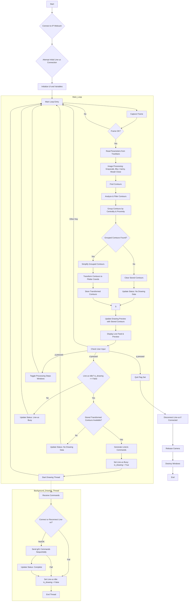

# The 1st Approach - Edge Detection and Contour Simplification then Choosing the Closed Subjects to the Center

## The notes and the flowchart

### Process Explanation for Image Processing & Contour Grouping System

**1. Overview**

This system directly processes the video feed to identify shapes and outlines present in the scene. It applies a series of image processing steps to extract features, groups these features based on their location and proximity to the center of the frame, simplifies the resulting outlines, and converts them into drawing commands for the Line-us plotter. This method attempts to draw the actual geometry perceived by the camera, filtered and simplified, rather than mapping to pre-defined shapes.

**2. System Initialization**

The setup involves initializing the necessary components:
*   **Connect to Video Source:** The system attempts to establish a connection to the specified IP Webcam stream to receive video frames.
*   **Connect to Line-us:** An initial attempt is made to connect to the Line-us plotter via a TCP socket.
*   **Initialize UI and Controls:** OpenCV windows are created for displaying the live camera feed, a preview of the generated drawing, and a control window containing trackbars.
*   **Initialize Trackbars:** Trackbars are set up in the control window, allowing real-time adjustment of key image processing and grouping parameters (e.g., blur level, Canny thresholds, morphological kernel size, minimum contour area, simplification epsilon, center distance for seeds, grouping proximity distance).
*   **Initialize Variables:** Global state variables, including the drawing status flag (`is_drawing`), status message, and storage for the latest valid transformed contours (`last_valid_contours`), are initialized.

**3. Real-time Processing Loop**

The core functionality resides in a continuous loop that processes video frames:

*   **Frame Acquisition:** A new frame is read from the IP Webcam stream.
*   **Parameter Reading:** The current values of all image processing and grouping parameters are read from the trackbars in the control window. This allows for dynamic tuning.
*   **Image Processing Pipeline:** The captured frame undergoes a sequence of transformations:
    *   **Grayscale Conversion:** The color image is converted to grayscale.
    *   **Gaussian Blur:** A Gaussian blur filter is applied to reduce noise (kernel size controlled by trackbar).
    *   **Canny Edge Detection:** Edges are detected in the blurred image, resulting in a binary edge map (thresholds controlled by trackbars).
    *   **Morphological Closing:** A morphological closing operation is applied to the edge map. This helps to close small gaps and merge nearby parallel edges (like the two sides of a drawn line) into single, more continuous features (kernel size controlled by trackbar).
*   **Contour Finding:** Contours (outlines) are found in the processed edge map using `cv2.findContours`. The hierarchy of contours is also retrieved (`RETR_TREE`) to understand parent-child relationships (e.g., holes within shapes).
*   **Contour Analysis and Filtering:** Each detected contour is analyzed to calculate its area and centroid. Contours below a minimum area threshold (controlled by trackbar) are discarded to remove noise.
*   **Contour Grouping (Centrality & Proximity):**
    *   Contours whose centroids are within a specified distance from the image center (controlled by trackbar) are identified as initial "seed" contours.
    *   An iterative process then expands this group: starting from the seed contours, it identifies all other contours whose centroids are within a defined proximity distance (controlled by trackbar) of any contour already added to the group. This groups together contours belonging to the central object and its nearby parts (like eyes, mouth, or internal details).
*   **Contour Simplification:** Each contour belonging to the final grouped set is simplified into a polygon using the Ramer-Douglas-Peucker algorithm (`cv2.approxPolyDP`). This reduces the number of points in the contour while preserving its general shape, converting curves into sequences of straight line segments (epsilon parameter controlled by trackbar). Duplicate simplified shapes are filtered out.
*   **Coordinate Transformation:** The coordinates of the simplified contour points are transformed from the image's pixel coordinate system to the Line-us plotter's coordinate system (scaling and offsetting to fit the defined plotter area, and clamping to ensure points are within bounds).
*   **Store Result:** The list of transformed, simplified contours is stored in `last_valid_contours`.
*   **Visualization:** The system displays:
    *   The `Live Camera Feed`.
    *   Optional intermediate processing steps (Blur, Canny, Morph, Grouping Result) if toggled ('p' key).
    *   The `Drawing Preview` generated by drawing the lines defined by `last_valid_contours` on a canvas.
    *   The current `status_message` on the preview window.
*   **Drawing Trigger (Manual):** The system monitors keyboard input for the 'd' key. When 'd' is pressed:
    *   It checks if the Line-us is idle (`is_drawing == False`) and if there are valid contours stored (`last_valid_contours` is not empty).
    *   If conditions are met, the drawing process is initiated.
*   **Line-us Command Generation & Execution (Background Thread):**
    *   If a draw is triggered, the `is_drawing` flag is set to `True`.
    *   Line-us specific commands (sequences of `(x, y, z)` tuples for `g01`) are generated based on the stored `last_valid_contours`.
    *   A new background thread (`execute_lineus_drawing`) is started to handle connecting to the Line-us (if needed), sending the commands sequentially, and managing connection/communication errors.
    *   Upon completion or error, the thread sets `is_drawing` back to `False` and updates the `status_message`.

**4. Termination**

*   The loop continues until the 'q' key is pressed.
*   Upon exiting the loop, the video capture is released, the system attempts to disconnect the Line-us cleanly, any active drawing thread is briefly waited upon, and all OpenCV windows are closed.

**5. Key Characteristics of this Approach**

*   **Direct Outline Drawing:** Generates drawing based directly on the detected shapes in the image.
*   **Flexibility:** Can potentially draw any object's outline, regardless of whether its class is known, as long as its edges are detectable.
*   **Tunable Detail:** The image processing parameters offer fine-grained control over how detected shapes are simplified and drawn.
*   **Clutter Reduction:** The centrality and proximity grouping helps focus the drawing on the main subject and related parts, ignoring distant clutter.
*   **Sensitivity to Parameters:** Performance and output quality are highly dependent on tuning the image processing parameters correctly for different lighting and object types.
*   **Drawing Complexity:** The output complexity can vary greatly depending on the object and parameter settings, potentially leading to many lines for detailed objects.

---

### Flowchart (Mermaid)



## The program

```python
import cv2
import numpy as np
import time
import math
import re
from collections import deque
import socket # Required by LineUs class
import threading # For non-blocking drawing

# --- Configuration ---
IP_WEBCAM_URL = "http://192.168.100.76:8080/video"
LINE_US_HOSTNAME = 'l1i2n3e4u5s6.local' # <-- YOUR LINE-US HOSTNAME

# --- ADJUST COORDINATE RANGE FOR LINE-US ---
# Common Line-us range is roughly 0-2000 or more. Adjust as needed.
PLOTTER_WIDTH_MM = 2000 # Example Line-us X range
PLOTTER_HEIGHT_MM = 2000 # Example Line-us Y range

# Line-us Pen Positions (Adjust if your setup differs)
LINE_US_PEN_DOWN_Z = 0
LINE_US_PEN_UP_Z = 1000

# == Initial Parameter Values (Will be controlled by Trackbars) ==
INITIAL_BLUR_KERNEL_SIZE = 15
INITIAL_CANNY_THRESHOLD1 = 30
INITIAL_CANNY_THRESHOLD2 = 80
INITIAL_MORPH_KERNEL_SIZE = 3
INITIAL_MIN_CONTOUR_AREA = 15
INITIAL_SIMPLIFY_EPSILON_FACTOR = 0.004
INITIAL_MAX_CENTER_DISTANCE_FACTOR = 0.3
INITIAL_GROUPING_DISTANCE_FACTOR = 0.15
EPSILON_SCALE_FACTOR = 10000.0
CENTER_DIST_SCALE_FACTOR = 100.0
GROUP_DIST_SCALE_FACTOR = 100.0

# Visualization Parameters
VIS_CANVAS_SIZE = (800, 600)
VIS_PADDING = 50
VIS_PEN_DOWN_COLOR = (0, 0, 0)
VIS_LINE_THICKNESS = 1
VIS_SEED_COLOR = (0, 255, 0)
VIS_GROUPED_COLOR = (0, 255, 255)
VIS_REJECTED_COLOR = (150, 150, 150)

# --- Global Variables for Line-us Control ---
my_line_us_instance = None # Holds the LineUs object
is_drawing = False # Flag to prevent concurrent drawing threads
last_valid_contours = [] # Store latest good contours for drawing
status_message = "Status: Idle" # For displaying messages

# --- LineUs Class (Copied from your example) ---
class LineUs:
    """An example class to show how to use the Line-us API"""
    def __init__(self, line_us_name):
        self.__line_us = socket.socket(socket.AF_INET, socket.SOCK_STREAM)
        # Set a timeout for connection and operations
        self.__line_us.settimeout(5.0) # 5 second timeout
        self.__line_us.connect((line_us_name, 1337))
        self.__connected = True
        self.__hello_message = self.__read_response()

    def get_hello_string(self):
        if self.__connected:
            return self.__hello_message.decode()
        else:
            return 'Not connected'

    def disconnect(self):
        """Close the connection to the Line-us"""
        try:
            self.__line_us.close()
        except socket.error as e:
            print(f"Socket error during disconnect: {e}")
        self.__connected = False

    def g01(self, x, y, z):
        """Send a G01 (interpolated move), and wait for the response before returning"""
        if not self.__connected:
             print("Error: Not connected to Line-us.")
             return # Or raise an exception

        # Ensure coordinates are integers for Line-us
        x_int = int(round(x))
        y_int = int(round(y))
        z_int = int(round(z))

        cmd = b'G01 X'
        cmd += str(x_int).encode()
        cmd += b' Y'
        cmd += str(y_int).encode()
        cmd += b' Z'
        cmd += str(z_int).encode()
        self.__send_command(cmd)
        response = self.__read_response() # Wait for 'ok'
        # print(f"  Sent: {cmd.decode()}, Received: {response.decode()}") # Debugging

    def __read_response(self):
        """Read from the socket one byte at a time until we get a null"""
        line = b''
        start_time = time.time()
        while True:
            try:
                char = self.__line_us.recv(1)
                if not char: # Connection closed by peer
                    print("Error: Line-us connection closed unexpectedly while reading.")
                    self.__connected = False
                    raise socket.error("Connection closed by peer")
                if char != b'\x00':
                    line += char
                elif char == b'\x00':
                    break
                if time.time() - start_time > self.__line_us.gettimeout():
                     print("Error: Timeout reading response from Line-us.")
                     raise socket.timeout("Timeout reading response")
            except socket.timeout:
                print("Error: Socket timeout during read.")
                self.__connected = False
                raise # Re-raise the timeout exception
            except socket.error as e:
                print(f"Socket error during read: {e}")
                self.__connected = False
                raise # Re-raise the socket error
        return line

    def __send_command(self, command):
        """Send the command to Line-us"""
        if not self.__connected: return # Or raise error
        try:
            command += b'\x00'
            self.__line_us.sendall(command) # Use sendall for reliability
        except socket.error as e:
            print(f"Socket error during send: {e}")
            self.__connected = False
            raise # Re-raise the socket error

# --- Processing Functions ---

def calculate_centroid(contour):
    M = cv2.moments(contour)
    if M["m00"] == 0: return None
    cx = int(M["m10"] / M["m00"])
    cy = int(M["m01"] / M["m00"])
    return (cx, cy)

def process_image(frame, blur_ksize, canny1, canny2, morph_ksize, min_area, epsilon_factor,
                  center_dist_factor, group_dist_factor, show_processing_steps=True):
    # (Identical to previous version - processes frame, returns simplified contours)
    if frame is None: return []
    img_h, img_w = frame.shape[:2]
    img_center_x, img_center_y = img_w // 2, img_h // 2
    img_diagonal = math.sqrt(img_h**2 + img_w**2)
    max_center_distance = img_diagonal * 0.5 * center_dist_factor
    max_grouping_distance = img_diagonal * group_dist_factor
    gray = cv2.cvtColor(frame, cv2.COLOR_BGR2GRAY)
    if blur_ksize < 1: blur_ksize = 1
    if blur_ksize % 2 == 0: blur_ksize += 1
    blurred = cv2.GaussianBlur(gray, (blur_ksize, blur_ksize), 0)
    if show_processing_steps: cv2.imshow('1 - Blurred Image', blurred)
    edges = cv2.Canny(blurred, canny1, canny2)
    if show_processing_steps: cv2.imshow('2 - Canny Edges', edges)
    closed_edges = edges
    if morph_ksize > 0:
        if morph_ksize % 2 == 0: morph_ksize += 1
        kernel = cv2.getStructuringElement(cv2.MORPH_RECT, (morph_ksize, morph_ksize))
        closed_edges = cv2.morphologyEx(edges, cv2.MORPH_CLOSE, kernel)
        if show_processing_steps: cv2.imshow('3 - Morph Closed Edges', closed_edges)
    contours, hierarchy = cv2.findContours(closed_edges, cv2.RETR_TREE, cv2.CHAIN_APPROX_SIMPLE)
    contour_data = {}
    seed_indices = set()
    for i, cnt in enumerate(contours):
        area = cv2.contourArea(cnt)
        if area < min_area: continue
        centroid = calculate_centroid(cnt)
        if centroid is None: continue
        contour_data[i] = {'contour': cnt, 'area': area, 'centroid': centroid}
        cx, cy = centroid
        distance_from_center = math.sqrt((cx - img_center_x)**2 + (cy - img_center_y)**2)
        if distance_from_center <= max_center_distance: seed_indices.add(i)
    if not seed_indices:
        if show_processing_steps:
            try: cv2.destroyWindow('1 - Blurred Image')
            except cv2.error: pass
            try: cv2.destroyWindow('2 - Canny Edges')
            except cv2.error: pass
            try: cv2.destroyWindow('3 - Morph Closed Edges')
            except cv2.error: pass
            try: cv2.destroyWindow('4 - Grouping Result')
            except cv2.error: pass
        return []
    final_group_indices = set()
    queue = deque(seed_indices)
    processed = set(seed_indices)
    while queue:
        current_idx = queue.popleft()
        final_group_indices.add(current_idx)
        if current_idx not in contour_data: continue
        current_centroid = contour_data[current_idx]['centroid']
        for other_idx, data in contour_data.items():
            if other_idx in processed or other_idx == current_idx: continue
            other_centroid = data['centroid']
            dist_sq = (current_centroid[0] - other_centroid[0])**2 + (current_centroid[1] - other_centroid[1])**2
            if dist_sq <= max_grouping_distance**2:
                processed.add(other_idx)
                queue.append(other_idx)
    simplified_contours = []
    unique_simplified_shapes = []
    vis_grouping = None
    if show_processing_steps: vis_grouping = frame.copy()
    for i in final_group_indices:
        if i not in contour_data: continue
        cnt = contour_data[i]['contour']
        perimeter = cv2.arcLength(cnt, True)
        if perimeter <= 0: continue
        epsilon = epsilon_factor * perimeter
        approx = cv2.approxPolyDP(cnt, epsilon, True)
        if len(approx) >= 2:
            approx_tuple = tuple(map(tuple, approx.reshape(-1, 2)))
            is_duplicate = any(len(approx_tuple) == len(existing) and approx_tuple == existing for existing in unique_simplified_shapes)
            if not is_duplicate:
                simplified_contours.append(approx)
                unique_simplified_shapes.append(approx_tuple)
    if show_processing_steps and vis_grouping is not None:
        for i, data in contour_data.items():
             if i in contour_data:
                 cnt = data['contour']
                 color = VIS_REJECTED_COLOR; thickness = 1
                 if i in final_group_indices:
                     color = VIS_GROUPED_COLOR; thickness = 2
                     if i in seed_indices: color = VIS_SEED_COLOR
                 cv2.drawContours(vis_grouping, [cnt], -1, color, thickness)
        cv2.circle(vis_grouping, (img_center_x, img_center_y), int(max_center_distance), (255, 100, 100), 1)
        cv2.circle(vis_grouping, (img_center_x, img_center_y), 3, (255, 100, 100), -1)
        cv2.imshow('4 - Grouping Result', vis_grouping)
    if not show_processing:
        try: cv2.destroyWindow('1 - Blurred Image')
        except cv2.error: pass
        try: cv2.destroyWindow('2 - Canny Edges')
        except cv2.error: pass
        try: cv2.destroyWindow('3 - Morph Closed Edges')
        except cv2.error: pass
        try: cv2.destroyWindow('4 - Grouping Result')
        except cv2.error: pass
    return simplified_contours

def transform_coordinates(contours, img_shape, plotter_dims):
    # (Identical - transforms to plotter_dims which should now match Line-us)
    if not contours: return []
    img_h, img_w = img_shape[:2]
    plotter_w, plotter_h = plotter_dims
    transformed_contours = []
    # Handle potential division by zero if camera gives weird dimensions
    if img_w <= 0 or img_h <= 0: return []
    scale = min(plotter_w / img_w, plotter_h / img_h)
    offset_x = (plotter_w - img_w * scale) / 2.0
    offset_y = (plotter_h - img_h * scale) / 2.0
    for contour in contours:
        transformed_contour = [(pt[0][0] * scale + offset_x, pt[0][1] * scale + offset_y) for pt in contour]
        # --- Clamp coordinates to valid plotter range ---
        clamped_contour = []
        for x, y in transformed_contour:
            clamped_x = max(0, min(plotter_w, x))
            clamped_y = max(0, min(plotter_h, y))
            clamped_contour.append((clamped_x, clamped_y))
        transformed_contours.append(clamped_contour)
    return transformed_contours

# --- NEW function to generate Line-us specific command list ---
def generate_lineus_commands(transformed_contours, pen_up_z, pen_down_z):
    """Generates a list of commands for the LineUs g01 method."""
    if not transformed_contours: return []
    print(f"Generating Line-us commands for {len(transformed_contours)} contours...")
    commands = []
    # Start with pen up
    commands.append(('lift', 0, 0, pen_up_z)) # Go to origin (optional) lifted

    for contour_idx, contour in enumerate(transformed_contours):
        if len(contour) >= 2:
            start_x, start_y = contour[0]

            # Move to the start of the contour with pen up
            commands.append(('move', start_x, start_y, pen_up_z))

            # Lower the pen before drawing segments
            commands.append(('move', start_x, start_y, pen_down_z))

            # Draw segments connecting point i to point i+1
            for i in range(len(contour)):
                target_i = (i + 1) % len(contour)
                target_x, target_y = contour[target_i]
                commands.append(('move', target_x, target_y, pen_down_z))

            # Lift pen after finishing the contour (at the last point)
            last_x, last_y = contour[-1]
            commands.append(('lift', last_x, last_y, pen_up_z))
        else:
             print(f"  Skipping contour {contour_idx} - only {len(contour)} points.")

    # Optional: Return to origin at the end
    commands.append(('lift', 0, 0, pen_up_z))
    print(f"Generated {len(commands)} Line-us commands.")
    return commands

# --- NEW function to execute drawing in a separate thread ---
def execute_lineus_drawing(commands_to_draw, hostname):
    """Connects to Line-us, sends commands, disconnects. Runs in a thread."""
    global my_line_us_instance, is_drawing, status_message

    status_message = f"Status: Connecting to {hostname}..."
    print(status_message)
    try:
        # Connect if not already connected (or reconnect if disconnected)
        if my_line_us_instance is None or not my_line_us_instance._LineUs__connected:
             my_line_us_instance = LineUs(hostname)
             print(f"Connected: {my_line_us_instance.get_hello_string()}")
        else:
             print("Already connected to Line-us.")

        status_message = "Status: Drawing..."
        print(status_message)
        start_time = time.time()

        # Send commands
        for i, cmd_tuple in enumerate(commands_to_draw):
             cmd_type, x, y, z = cmd_tuple
             print(f"  Sending cmd {i+1}/{len(commands_to_draw)}: {cmd_type} X{x:.0f} Y{y:.0f} Z{z:.0f}")
             my_line_us_instance.g01(x, y, z)
             # Small delay might help Line-us stability? Optional.
             # time.sleep(0.01)

        end_time = time.time()
        status_message = f"Status: Drawing complete ({len(commands_to_draw)} cmds in {end_time - start_time:.2f}s)"
        print(status_message)

        # Decide whether to disconnect or keep alive - keeping alive for now
        # my_line_us_instance.disconnect()
        # print("Disconnected from Line-us.")

    except (socket.error, socket.timeout) as e:
        status_message = f"Status: Error - {e}"
        print(f"Line-us Error: {e}")
        if my_line_us_instance:
            my_line_us_instance.disconnect() # Ensure disconnect on error
        my_line_us_instance = None # Reset instance
    except Exception as e:
        status_message = f"Status: Unexpected Error - {e}"
        print(f"Unexpected error during Line-us communication: {e}")
        if my_line_us_instance:
            my_line_us_instance.disconnect()
        my_line_us_instance = None
    finally:
        is_drawing = False # Allow new drawing attempts

# G-code / Canvas drawing functions (extract_xy, draw_gcode_on_canvas) are NO LONGER NEEDED
# We visualize the transformed_contours directly now before sending.

# --- Main Execution Loop ---
if __name__ == "__main__":
    print("Starting Real-time Camera-to-LineUs Control...")
    print(f"Attempting to connect to IP Webcam at: {IP_WEBCAM_URL}")
    print(f"Line-us Hostname: {LINE_US_HOSTNAME}")
    print("Press 'p' to toggle processing steps windows.")
    print("Press 'd' to send current drawing to Line-us.")
    print("Press 'q' to quit.")

    cap = cv2.VideoCapture(IP_WEBCAM_URL)
    if not cap.isOpened(): print(f"Error: Cannot open IP Webcam stream at {IP_WEBCAM_URL}"); exit()
    print("Successfully connected to IP Webcam.")

    # Create persistent canvas for G-code style PREVIEW
    preview_canvas = np.ones((VIS_CANVAS_SIZE[1], VIS_CANVAS_SIZE[0], 3), dtype=np.uint8) * 255
    cv2.namedWindow('Drawing Preview')
    cv2.namedWindow('Live Camera Feed')
    cv2.namedWindow('Controls', cv2.WINDOW_NORMAL)

    def nothing(x): pass
    cv2.createTrackbar('Blur Kernel', 'Controls', INITIAL_BLUR_KERNEL_SIZE, 51, nothing)
    cv2.createTrackbar('Canny Thr1', 'Controls', INITIAL_CANNY_THRESHOLD1, 255, nothing)
    cv2.createTrackbar('Canny Thr2', 'Controls', INITIAL_CANNY_THRESHOLD2, 255, nothing)
    cv2.createTrackbar('Morph Kernel', 'Controls', INITIAL_MORPH_KERNEL_SIZE, 21, nothing)
    cv2.createTrackbar('Min Area', 'Controls', INITIAL_MIN_CONTOUR_AREA, 1000, nothing)
    cv2.createTrackbar('Epsilon*10k', 'Controls', int(INITIAL_SIMPLIFY_EPSILON_FACTOR * EPSILON_SCALE_FACTOR), 100, nothing)
    cv2.createTrackbar('Center Dist*100', 'Controls', int(INITIAL_MAX_CENTER_DISTANCE_FACTOR * CENTER_DIST_SCALE_FACTOR), 100, nothing)
    cv2.createTrackbar('Group Dist*100', 'Controls', int(INITIAL_GROUPING_DISTANCE_FACTOR * GROUP_DIST_SCALE_FACTOR), 100, nothing)

    show_processing = False
    drawing_thread = None # Keep track of the drawing thread

    while True:
        # 1. Capture Frame
        ret, frame = cap.read()
        if not ret: time.sleep(0.5); continue # Skip frame if read fails

        # 2. Read Parameters
        blur_ksize_raw = cv2.getTrackbarPos('Blur Kernel', 'Controls')
        canny1 = cv2.getTrackbarPos('Canny Thr1', 'Controls')
        canny2 = cv2.getTrackbarPos('Canny Thr2', 'Controls')
        morph_ksize_raw = cv2.getTrackbarPos('Morph Kernel', 'Controls')
        min_area = cv2.getTrackbarPos('Min Area', 'Controls')
        epsilon_factor = cv2.getTrackbarPos('Epsilon*10k', 'Controls') / EPSILON_SCALE_FACTOR
        center_dist_factor = cv2.getTrackbarPos('Center Dist*100', 'Controls') / CENTER_DIST_SCALE_FACTOR
        group_dist_factor = cv2.getTrackbarPos('Group Dist*100', 'Controls') / GROUP_DIST_SCALE_FACTOR
        blur_ksize = max(1, blur_ksize_raw);
        if blur_ksize % 2 == 0: blur_ksize += 1
        morph_ksize = morph_ksize_raw
        if morph_ksize > 0 and morph_ksize % 2 == 0: morph_ksize += 1

        # 3. Process Image
        simplified_contours = process_image(
            frame, blur_ksize, canny1, canny2, morph_ksize,
            min_area, epsilon_factor, center_dist_factor, group_dist_factor,
            show_processing
        )

        # 4. Transform and Store if valid
        current_transformed_contours = []
        if simplified_contours:
            current_transformed_contours = transform_coordinates(
                simplified_contours, frame.shape, (PLOTTER_WIDTH_MM, PLOTTER_HEIGHT_MM))
            if current_transformed_contours: # Only update if transform was successful
                 last_valid_contours = current_transformed_contours # Store for 'd' press

        # 5. Visualize Drawing Preview (using the stored last_valid_contours)
        preview_canvas.fill(255) # Clear preview canvas
        preview_h, preview_w = preview_canvas.shape[:2] # *** GET DIMENSIONS HERE ***

        if last_valid_contours:
            # Draw the contours directly onto the preview canvas (scaled)
            # Find bounds of the transformed contours to scale them to preview window
            all_points = np.concatenate([np.array(c) for c in last_valid_contours]) if last_valid_contours else np.array([])
            if all_points.size > 0:
                min_x, min_y = np.min(all_points, axis=0)
                max_x, max_y = np.max(all_points, axis=0)
                draw_w = max(max_x - min_x, 1.0)
                draw_h = max(max_y - min_y, 1.0)
                scale = min((preview_w - 2*VIS_PADDING)/draw_w, (preview_h - 2*VIS_PADDING)/draw_h) if draw_w > 0 and draw_h > 0 else 1.0
                offset_x = VIS_PADDING + ((preview_w - 2*VIS_PADDING) - draw_w * scale) / 2.0
                offset_y = VIS_PADDING + ((preview_h - 2*VIS_PADDING) - draw_h * scale) / 2.0

                for contour in last_valid_contours:
                    points_scaled = []
                    for x, y in contour:
                        px = int(offset_x + (x - min_x) * scale)
                        py = int(offset_y + (y - min_y) * scale) # No Y flip needed here
                        points_scaled.append([px, py])
                    cv2.polylines(preview_canvas, [np.array(points_scaled, dtype=np.int32)], isClosed=True, color=VIS_PEN_DOWN_COLOR, thickness=VIS_LINE_THICKNESS)

        # Add status message to preview (Now preview_h is always defined)
        cv2.putText(preview_canvas, status_message, (10, preview_h - 10),
                    cv2.FONT_HERSHEY_SIMPLEX, 0.5, (100, 100, 100), 1)

        # 6. Display Windows
        cv2.imshow('Live Camera Feed', frame)
        cv2.imshow('Drawing Preview', preview_canvas)

        # 7. Handle Keyboard Input
        key = cv2.waitKey(1) & 0xFF
        if key == ord('q'): print("Quit key pressed. Exiting."); break
        elif key == ord('p'):
            show_processing = not show_processing
            print(f"Processing steps windows {'shown' if show_processing else 'hidden'}.")
            if not show_processing: # Destroy windows when hiding
                 try: cv2.destroyWindow('1 - Blurred Image')
                 except cv2.error: pass
                 try: cv2.destroyWindow('2 - Canny Edges')
                 except cv2.error: pass
                 try: cv2.destroyWindow('3 - Morph Closed Edges')
                 except cv2.error: pass
                 try: cv2.destroyWindow('4 - Grouping Result')
                 except cv2.error: pass
        elif key == ord('d'):
            if not is_drawing:
                if last_valid_contours:
                    print("\n'Draw' key pressed. Preparing to send to Line-us...")
                    status_message = "Status: Generating commands..."
                    lineus_commands = generate_lineus_commands(
                        last_valid_contours, LINE_US_PEN_UP_Z, LINE_US_PEN_DOWN_Z
                    )
                    if lineus_commands:
                         is_drawing = True
                         drawing_thread = threading.Thread(
                             target=execute_lineus_drawing,
                             args=(lineus_commands, LINE_US_HOSTNAME),
                             daemon=True
                         )
                         drawing_thread.start()
                    else: status_message = "Status: No commands generated."
                else: status_message = "Status: No valid drawing found yet."
            else: status_message = "Status: Already drawing..."
            print(status_message) # Print status after handling 'd'

    # Cleanup
    print("Releasing camera and closing windows...")
    cap.release()
    if my_line_us_instance and my_line_us_instance._LineUs__connected:
        print("Disconnecting from Line-us...")
        my_line_us_instance.disconnect()
    if drawing_thread and drawing_thread.is_alive():
         print("Waiting for drawing thread to finish...")
         drawing_thread.join(timeout=2.0)
    cv2.destroyAllWindows()
    print("Done.")
```
