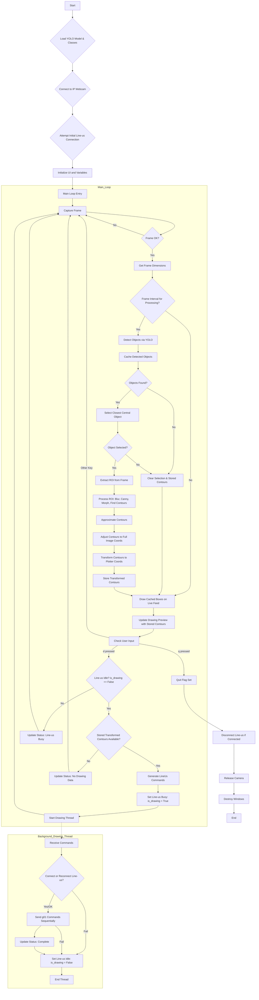

# The 2nd Approach - Object Detection then Contour the ROI

## The notes and the flowchart

### Process Explanation for Object Detection + ROI Contour System

**1. Overview**

This system represents a hybrid approach, using object detection to first identify a primary subject and then applying image processing techniques *specifically* within that subject's area to generate a line drawing. This addresses the limitations of simple contour-only methods (sensitive to background clutter) and database-only methods (limited to pre-defined shapes). The drawing commands are derived from the detected object's actual outline within the isolated region of interest (ROI).

**2. System Initialization**

The system begins with setup procedures:
*   **Load Object Detection Model:** A pre-trained YOLOv3-tiny model, along with its configuration and class names (`.cfg`, `.weights`, `.names`), is loaded using OpenCV's DNN module. This model is used to find objects within the video frames.
*   **Connect to Video Source:** The system attempts to establish a connection to the IP Webcam stream.
*   **Connect to Line-us:** An initial attempt is made to connect to the Line-us plotter via TCP.
*   **Initialize Visualization:** Windows are created for displaying the live camera feed (overlaid with detection results) and a preview of the drawing that would be sent to the plotter.
*   **Initialize Variables:** State variables like the drawing flag (`is_drawing`), status message, and caches for detected objects and transformed contours are initialized.

**3. Real-time Processing Loop**

The system operates in a continuous loop:

*   **Frame Acquisition:** A frame is captured from the video stream.
*   **Performance Optimization (Frame Skipping):** To manage computational load, the full object detection and subsequent processing steps are performed only on every Nth frame (`FRAME_PROCESS_INTERVAL`). The display updates on every frame using cached results.
*   **Object Detection (Conditional):** If the current frame is selected for processing:
    *   The frame is passed to the object detection function (`detect_objects`), which uses the loaded YOLO model. This function pre-processes the frame (e.g., resizing to 416x416), runs the neural network, and processes the output using confidence thresholds and Non-Maximum Suppression to yield a list of detected objects (labels, bounding boxes, confidence scores).
    *   The list of detected objects is stored in a cache (`detected_objects_cache`) for display.
*   **Target Selection:** From the list of detected objects from the current processing cycle, the object whose bounding box center is closest to the image center is identified as the primary target. This ensures the drawing focuses on the main subject in the camera's view.
*   **ROI Extraction:** If a primary target object is selected, its bounding box defines a Region of Interest (ROI) within the original video frame. This ROI is extracted.
*   **Outline Generation within ROI:** The image processing pipeline (blurring, Canny edge detection, morphological closing, contour finding, and `approxPolyDP` simplification) is applied *only* to the pixels within the extracted ROI. This generates a set of simplified contours representing the outline(s) of the object within its detected bounding box.
*   **Coordinate Transformation:** The coordinates of the simplified contours, which are currently relative to the top-left corner of the ROI, are adjusted back to the full image's coordinate system (by adding the ROI's top-left offset). These full-image coordinates are then transformed to the Line-us plotter's coordinate system (scaled and potentially offset to fit the drawing area). The resulting list of transformed contours is stored (`last_valid_contours_transformed`).
*   **Visualization:** On every loop iteration:
    *   The `Live Camera Feed with Detections` window shows the current frame with bounding boxes from the `detected_objects_cache` overlaid. The box of the object selected as the primary target in the last processing cycle is highlighted.
    *   The `Drawing Preview` window displays a representation of the transformed contours stored in `last_valid_contours_transformed`, showing the exact lines that would be sent to the Line-us.
    *   The current system status is displayed on the preview window.
*   **Drawing Trigger (Manual):** The system listens for keyboard input ('d' key). When 'd' is pressed:
    *   It checks if the Line-us is not currently busy (`is_drawing == False`).
    *   It checks if there are valid transformed contours stored (`last_valid_contours_transformed` is not empty).
    *   If both conditions are met, the drawing process is initiated.
*   **Line-us Command Generation & Execution (Background Thread):**
    *   If a draw is triggered, the `is_drawing` flag is set to `True`.
    *   The stored `last_valid_contours_transformed` are used to generate a sequence of `(x, y, z)` commands suitable for the Line-us's `g01` method (`generate_lineus_commands`).
    *   A new background thread is created targeting `execute_lineus_drawing`. This thread handles connecting to the Line-us (if needed), sending the generated commands sequentially, and managing connection errors.
    *   Upon completion or error, the thread sets `is_drawing` back to `False` and updates the `status_message`.

**4. Termination**

*   The main loop exits when the 'q' key is pressed.
*   Cleanup involves releasing the camera, attempting to disconnect the Line-us cleanly, waiting for any active drawing thread to finish, and destroying all OpenCV windows.

**5. Characteristics of this Approach**

*   **Hybrid:** Combines the specificity of object detection with the flexibility of contour-based drawing.
*   **Subject-Focused:** Reliably targets a single, central object for drawing.
*   **Clutter-Resistant:** Ignores areas outside the selected object's bounding box.
*   **Detail Level Tunable:** The image processing parameters (Blur, Canny, Morph, Epsilon, Min Area) within the ROI allow tuning the complexity of the outline drawn for the detected object.
*   **Orientation:** Relies on the object detection model's ability to correctly bound the object regardless of its orientation. The drawing generated within that box is the contour outline.

---

### Flowchart (Mermaid)



## The program

```python
import cv2
import numpy as np
import time
import math
import re
from collections import deque
import socket # Required by LineUs class
import threading # For non-blocking drawing
import os # For joining paths

# --- Configuration ---
IP_WEBCAM_URL = "http://192.168.100.76:8080/video" # <-- YOUR PHONE'S IP WEBCAM URL
LINE_US_HOSTNAME = 'l1i2n3e4u5s6.local' # <-- YOUR LINE-US HOSTNAME

# --- Object Detection Model Files ---
# *** USING FULL YOLOV3 ***
# Make sure these files are downloaded and accessible in the same directory or provide full paths
MODEL_CONFIG = "yolov3.cfg"
MODEL_WEIGHTS = "yolov3.weights"
CLASS_NAMES_FILE = "coco.names"
# Check if files exist
if not all(os.path.exists(f) for f in [MODEL_CONFIG, MODEL_WEIGHTS, CLASS_NAMES_FILE]):
    print("ERROR: Model files (.cfg, .weights, .names) not found.")
    print(f"Required: {MODEL_CONFIG}, {MODEL_WEIGHTS}, {CLASS_NAMES_FILE}")
    print("Please download the specified YOLO model files and place them")
    print("in the same directory as the script or update the paths.")
    exit()

# Object Detection Parameters
CONFIDENCE_THRESHOLD = 0.5 # Default confidence for full YOLO often higher
NMS_THRESHOLD = 0.4       # Default NMS for full YOLO often higher

# Line-us / Plotter Configuration
PLOTTER_WIDTH_MM = 2000 # Example Line-us X range (Adjust as needed)
PLOTTER_HEIGHT_MM = 2000 # Example Line-us Y range (Adjust as needed)
LINE_US_PEN_DOWN_Z = 0
LINE_US_PEN_UP_Z = 1000

# == Initial Parameter Values (Trackbars) ==
INITIAL_BLUR_KERNEL_SIZE = 5 # Less blur might be better post-detection
INITIAL_CANNY_THRESHOLD1 = 50
INITIAL_CANNY_THRESHOLD2 = 150
INITIAL_MORPH_KERNEL_SIZE = 3
INITIAL_MIN_CONTOUR_AREA = 10 # Lower threshold for details within ROI
INITIAL_SIMPLIFY_EPSILON_FACTOR = 0.005 # Slightly more detail potentially needed
# Scaling factors
EPSILON_SCALE_FACTOR = 10000.0
# Center/Group Dist factors are less relevant now but keep for potential future use/UI consistency if desired
# INITIAL_MAX_CENTER_DISTANCE_FACTOR = 0.5
# INITIAL_GROUPING_DISTANCE_FACTOR = 0.2
# CENTER_DIST_SCALE_FACTOR = 100.0
# GROUP_DIST_SCALE_FACTOR = 100.0

# Visualization Parameters
VIS_CANVAS_SIZE = (800, 600)
VIS_PADDING = 50
VIS_PEN_DOWN_COLOR = (0, 0, 0)
VIS_LINE_THICKNESS = 1
VIS_BOX_COLOR = (0, 255, 0) # Green for detected boxes
VIS_SELECTED_BOX_COLOR = (0, 0, 255) # Red for the selected box
VIS_SEED_COLOR = (0, 255, 0)       # (Not used in object detection mode)
VIS_GROUPED_COLOR = (0, 255, 255)    # (Not used in object detection mode)
VIS_REJECTED_COLOR = (150, 150, 150) # (Not used in object detection mode)

# --- Global Variables ---
my_line_us_instance = None # Holds the LineUs object
is_drawing = False # Flag to prevent concurrent drawing threads
last_valid_contours_transformed = [] # Store latest good *transformed* contours for drawing
status_message = "Status: Idle" # For displaying messages
net = None # Global variable for the network
output_layers = None # Global variable for output layer names
classes = None # Global variable for class names

# --- LineUs Class ---
class LineUs:
    """An example class to show how to use the Line-us API"""
    def __init__(self, line_us_name):
        self.__line_us = socket.socket(socket.AF_INET, socket.SOCK_STREAM)
        # Set a timeout for connection and operations
        self.__line_us.settimeout(5.0) # 5 second timeout
        try:
            self.__line_us.connect((line_us_name, 1337))
            self.__connected = True
            self.__hello_message = self.__read_response()
        except (socket.error, socket.timeout) as e:
            print(f"Error connecting to Line-us '{line_us_name}': {e}")
            self.__connected = False
            self.__hello_message = b'Connection Failed'
            raise # Re-raise the exception to be caught by caller

    def get_hello_string(self):
        if self.__connected:
            return self.__hello_message.decode()
        else:
            return 'Not connected'

    def disconnect(self):
        """Close the connection to the Line-us"""
        if not self.__connected: return
        try:
            self.__line_us.close()
        except socket.error as e:
            print(f"Socket error during disconnect: {e}")
        self.__connected = False
        print("Line-us connection closed.")

    def g01(self, x, y, z):
        """Send a G01 (interpolated move), and wait for the response before returning"""
        if not self.__connected:
             print("Error: Not connected to Line-us.")
             raise ConnectionError("Not connected to Line-us") # Raise specific error

        # Ensure coordinates are integers for Line-us
        x_int = int(round(x))
        y_int = int(round(y))
        z_int = int(round(z))

        cmd = f'G01 X{x_int} Y{y_int} Z{z_int}'.encode()
        self.__send_command(cmd)
        response = self.__read_response() # Wait for 'ok'
        if response.lower() != b'ok':
             print(f"Warning: Unexpected response from Line-us: {response.decode()}")

    def __read_response(self):
        """Read from the socket one byte at a time until we get a null"""
        if not self.__connected: return b''
        line = b''
        start_time = time.time()
        try:
            while True:
                char = self.__line_us.recv(1)
                if not char: # Connection closed by peer
                    print("Error: Line-us connection closed unexpectedly while reading.")
                    self.__connected = False
                    raise socket.error("Connection closed by peer")
                if char != b'\x00':
                    line += char
                elif char == b'\x00':
                    break
                # Check timeout inside loop as well
                if time.time() - start_time > self.__line_us.gettimeout():
                     print("Error: Timeout reading response from Line-us.")
                     raise socket.timeout("Timeout reading response")
        except (socket.timeout, socket.error) as e:
            print(f"Socket error/timeout during read: {e}")
            self.__connected = False
            raise # Re-raise the exception
        return line

    def __send_command(self, command):
        """Send the command to Line-us"""
        if not self.__connected: return
        try:
            command += b'\x00'
            self.__line_us.sendall(command) # Use sendall for reliability
        except socket.error as e:
            print(f"Socket error during send: {e}")
            self.__connected = False
            raise # Re-raise the socket error

# --- Processing Functions ---

def load_object_detection_model():
    """Loads the YOLO model and class names."""
    global net, output_layers, classes
    print("Loading object detection model...")
    try:
        net = cv2.dnn.readNet(MODEL_WEIGHTS, MODEL_CONFIG)
        net.setPreferableBackend(cv2.dnn.DNN_BACKEND_OPENCV) # Try default backend first
        net.setPreferableTarget(cv2.dnn.DNN_TARGET_CPU)     # Use CPU

        layer_names = net.getLayerNames()
        out_layer_indices = net.getUnconnectedOutLayers()

        # Ensure correct handling of index format from getUnconnectedOutLayers
        if isinstance(out_layer_indices, np.ndarray):
             # If it's a 2D array like [[idx1], [idx2]], flatten it
             if out_layer_indices.ndim > 1:
                 out_layer_indices = out_layer_indices.flatten()
             # Indices are 1-based in older OpenCV versions? Check layer_names length
             output_layers = [layer_names[i - 1] for i in out_layer_indices if 0 < i <= len(layer_names)]
        elif isinstance(out_layer_indices, int): # If it's a single index
             if 0 < out_layer_indices <= len(layer_names):
                 output_layers = [layer_names[out_layer_indices - 1]]
             else: output_layers = [] # Invalid index
        else: # Handle other unexpected types if necessary
             print(f"Warning: Unexpected format for unconnected layers: {type(out_layer_indices)}")
             output_layers = [] # Fallback

        if not output_layers:
             print("Error: Could not determine output layer names.")
             exit()

        print(f"Determined output layers: {output_layers}")

        with open(CLASS_NAMES_FILE, "r") as f:
            classes = [line.strip() for line in f.readlines()]
        print(f"Model '{MODEL_CONFIG}' loaded successfully with {len(classes)} classes.")
    except cv2.error as e:
        print(f"OpenCV Error loading model: {e}")
        print("Ensure model files are correct and accessible.")
        exit()
    except Exception as e:
        print(f"Error loading model or class names: {e}")
        exit()

def detect_objects(frame):
    """Performs object detection on a frame."""
    global CONFIDENCE_THRESHOLD, NMS_THRESHOLD # Use global updated thresholds
    if net is None or output_layers is None or classes is None:
        print("Error: Model or classes not loaded.")
        return []

    height, width = frame.shape[:2]
    # Use input size appropriate for the model (416x416 is common for YOLOv3)
    input_size = (416, 416)
    blob = cv2.dnn.blobFromImage(frame, 1/255.0, input_size, swapRB=True, crop=False)
    net.setInput(blob)

    try:
        layer_outputs = net.forward(output_layers)
    except cv2.error as e:
        print(f"Error during model forward pass: {e}")
        return []

    boxes = []
    confidences = []
    class_ids = []

    for output in layer_outputs:
        for detection in output:
            scores = detection[5:]
            class_id = np.argmax(scores)
            confidence = scores[class_id]

            if confidence > CONFIDENCE_THRESHOLD:
                center_x = int(detection[0] * width)
                center_y = int(detection[1] * height)
                w = int(detection[2] * width)
                h = int(detection[3] * height)
                x = int(center_x - w / 2)
                y = int(center_y - h / 2)

                boxes.append([x, y, w, h])
                confidences.append(float(confidence))
                class_ids.append(class_id)

    # Apply Non-Max Suppression
    indices = cv2.dnn.NMSBoxes(boxes, confidences, CONFIDENCE_THRESHOLD, NMS_THRESHOLD)

    detected_objects = []
    if len(indices) > 0:
        final_indices = indices.flatten() if isinstance(indices, np.ndarray) else [indices]
        for i in final_indices:
             if 0 <= i < len(boxes):
                 box = boxes[i]
                 label = str(classes[class_ids[i]]) if 0 <= class_ids[i] < len(classes) else "Unknown"
                 confidence = confidences[i]
                 detected_objects.append({"label": label, "box": box, "confidence": confidence})
             else: print(f"Warning: NMS index {i} out of bounds for boxes list (length {len(boxes)}).")

    return detected_objects

def process_roi_for_outline(roi, blur_ksize, canny1, canny2, morph_ksize, min_area, epsilon_factor):
    """Applies image processing to find simplified contours within an ROI."""
    if roi is None or roi.size == 0: return []

    gray = cv2.cvtColor(roi, cv2.COLOR_BGR2GRAY)
    # Blur
    if blur_ksize < 1: blur_ksize = 1
    if blur_ksize % 2 == 0: blur_ksize += 1
    blurred = cv2.GaussianBlur(gray, (blur_ksize, blur_ksize), 0)
    # Canny
    edges = cv2.Canny(blurred, canny1, canny2)
    # Closing
    closed_edges = edges
    if morph_ksize > 0:
        if morph_ksize % 2 == 0: morph_ksize += 1
        kernel = cv2.getStructuringElement(cv2.MORPH_RECT, (morph_ksize, morph_ksize))
        closed_edges = cv2.morphologyEx(edges, cv2.MORPH_CLOSE, kernel)

    # Find Contours within ROI
    contours, _ = cv2.findContours(closed_edges, cv2.RETR_EXTERNAL, cv2.CHAIN_APPROX_SIMPLE)

    simplified_contours = []
    unique_simplified_shapes = []
    for cnt in contours:
        area = cv2.contourArea(cnt)
        if area < min_area: continue

        perimeter = cv2.arcLength(cnt, True)
        if perimeter <= 0: continue
        epsilon = epsilon_factor * perimeter
        approx = cv2.approxPolyDP(cnt, epsilon, True)

        if len(approx) >= 2:
            approx_tuple = tuple(map(tuple, approx.reshape(-1, 2)))
            is_duplicate = any(len(approx_tuple) == len(existing) and approx_tuple == existing for existing in unique_simplified_shapes)
            if not is_duplicate:
                simplified_contours.append(approx)
                unique_simplified_shapes.append(approx_tuple)

    return simplified_contours

def transform_coordinates(contours, img_shape, plotter_dims):
    """Transforms contours from image space to plotter space and clamps."""
    if not contours: return []
    img_h, img_w = img_shape[:2]
    plotter_w, plotter_h = plotter_dims
    transformed_contours = []
    if img_w <= 0 or img_h <= 0: return [] # Avoid division by zero

    scale = min(plotter_w / img_w, plotter_h / img_h)
    # Calculate offsets to center the scaled image within the plotter area
    offset_x = (plotter_w - img_w * scale) / 2.0
    offset_y = (plotter_h - img_h * scale) / 2.0

    for contour in contours:
        # Apply scaling and offset
        transformed_contour = [(pt[0][0] * scale + offset_x, pt[0][1] * scale + offset_y) for pt in contour]
        # Clamp coordinates to ensure they are within the plotter bounds
        clamped_contour = [(max(0.0, min(plotter_w, x)), max(0.0, min(plotter_h, y))) for x, y in transformed_contour]
        transformed_contours.append(clamped_contour)
    return transformed_contours

def generate_lineus_commands(transformed_contours, pen_up_z, pen_down_z):
    """Generates a list of commands ('move' or 'lift') for LineUs g01."""
    if not transformed_contours: return []
    print(f"Generating Line-us commands for {len(transformed_contours)} contours...")
    commands = []
    # Start with pen up, maybe move to a safe starting corner?
    commands.append(('lift', 0, 0, pen_up_z)) # Go to origin lifted

    for contour_idx, contour in enumerate(transformed_contours):
        if len(contour) >= 2:
            start_x, start_y = contour[0]

            # Move to the start of the contour with pen up
            commands.append(('move', start_x, start_y, pen_up_z))

            # Lower the pen before drawing segments
            commands.append(('move', start_x, start_y, pen_down_z))

            # Draw segments connecting point i to point i+1
            for i in range(len(contour)):
                target_i = (i + 1) % len(contour) # Wrap around for closed loop
                target_x, target_y = contour[target_i]
                commands.append(('move', target_x, target_y, pen_down_z))

            # Lift pen after finishing the contour (at the last point)
            # Use the target point of the last segment (which is the start point)
            last_drawn_x, last_drawn_y = contour[0]
            commands.append(('lift', last_drawn_x, last_drawn_y, pen_up_z))
        else:
             print(f"  Skipping contour {contour_idx} - only {len(contour)} points.")

    # Return to origin at the end
    commands.append(('lift', 0, 0, pen_up_z))
    print(f"Generated {len(commands)} Line-us commands.")
    return commands

def execute_lineus_drawing(commands_to_draw, hostname):
    """Connects to Line-us, sends commands, disconnects. Runs in a thread."""
    global my_line_us_instance, is_drawing, status_message

    status_message = f"Status: Connecting to {hostname}..."
    print(status_message)
    try:
        # Connect if not already connected (or reconnect if disconnected)
        if my_line_us_instance is None or not my_line_us_instance._LineUs__connected:
             # Ensure previous instance is properly closed if it exists but isn't connected
             if my_line_us_instance:
                 my_line_us_instance.disconnect()
             my_line_us_instance = LineUs(hostname) # This now raises errors on failure
             print(f"Connected: {my_line_us_instance.get_hello_string()}")
        else:
             print("Already connected to Line-us.")

        status_message = "Status: Drawing..."
        print(status_message)
        start_time = time.time()

        # Send commands
        for i, cmd_tuple in enumerate(commands_to_draw):
             cmd_type, x, y, z = cmd_tuple
             # print(f"  Sending cmd {i+1}/{len(commands_to_draw)}: {cmd_type} X{x:.0f} Y{y:.0f} Z{z:.0f}") # Verbose
             my_line_us_instance.g01(x, y, z) # This now raises errors on failure
             # Optional short sleep can sometimes help robot stability
             # time.sleep(0.01)

        end_time = time.time()
        status_message = f"Status: Drawing complete ({len(commands_to_draw)} cmds in {end_time - start_time:.2f}s)"
        print(status_message)

        # Optional: Disconnect after drawing? Or keep alive? Keeping alive for now.
        # my_line_us_instance.disconnect()
        # print("Disconnected from Line-us.")

    except (socket.error, socket.timeout, ConnectionError, AttributeError) as e: # Catch connection errors
        status_message = f"Status: Line-us Error - {e}"
        print(f"Line-us Error: {e}")
        if my_line_us_instance:
            my_line_us_instance.disconnect() # Ensure disconnect on error
        my_line_us_instance = None # Reset instance
    except Exception as e:
        status_message = f"Status: Unexpected Error - {e}"
        print(f"Unexpected error during Line-us communication: {e}")
        if my_line_us_instance:
            my_line_us_instance.disconnect()
        my_line_us_instance = None
    finally:
        is_drawing = False # Allow new drawing attempts regardless of outcome

# --- Main Execution Loop ---
if __name__ == "__main__":
    load_object_detection_model() # Load model at startup

    print("Starting Real-time Object Detection (Full YOLOv3) to LineUs Control...")
    print(f"Attempting to connect to IP Webcam at: {IP_WEBCAM_URL}")
    print(f"Line-us Hostname: {LINE_US_HOSTNAME}")
    print("Press 'p' to toggle ROI processing steps windows.")
    print("Press 'd' to send current drawing to Line-us.")
    print("Press 'q' to quit.")

    cap = cv2.VideoCapture(IP_WEBCAM_URL)
    if not cap.isOpened(): print(f"Error: Cannot open IP Webcam stream at {IP_WEBCAM_URL}"); exit()
    print("Successfully connected to IP Webcam.")

    preview_canvas = np.ones((VIS_CANVAS_SIZE[1], VIS_CANVAS_SIZE[0], 3), dtype=np.uint8) * 255
    cv2.namedWindow('Drawing Preview')
    cv2.namedWindow('Live Camera Feed with Detections')
    cv2.namedWindow('Controls', cv2.WINDOW_NORMAL)

    def nothing(x): pass
    cv2.createTrackbar('Blur Kernel (ROI)', 'Controls', INITIAL_BLUR_KERNEL_SIZE, 51, nothing)
    cv2.createTrackbar('Canny Thr1 (ROI)', 'Controls', INITIAL_CANNY_THRESHOLD1, 255, nothing)
    cv2.createTrackbar('Canny Thr2 (ROI)', 'Controls', INITIAL_CANNY_THRESHOLD2, 255, nothing)
    cv2.createTrackbar('Morph Kernel (ROI)', 'Controls', INITIAL_MORPH_KERNEL_SIZE, 21, nothing)
    cv2.createTrackbar('Min Area (ROI)', 'Controls', INITIAL_MIN_CONTOUR_AREA, 500, nothing)
    cv2.createTrackbar('Epsilon*10k (ROI)', 'Controls', int(INITIAL_SIMPLIFY_EPSILON_FACTOR * EPSILON_SCALE_FACTOR), 100, nothing)
    cv2.createTrackbar('Confidence*100', 'Controls', int(CONFIDENCE_THRESHOLD * 100), 100, nothing)
    cv2.createTrackbar('NMS Thr*100', 'Controls', int(NMS_THRESHOLD * 100), 100, nothing)

    show_processing = False
    drawing_thread = None
    last_valid_contours_transformed = [] # Reset storage

    while True:
        # 1. Capture Frame
        ret, frame = cap.read()
        if not ret: time.sleep(0.5); continue

        frame_for_display = frame.copy()
        img_h, img_w = frame.shape[:2]
        img_center_x, img_center_y = img_w // 2, img_h // 2

        # 2. Read Parameters
        blur_ksize_raw = cv2.getTrackbarPos('Blur Kernel (ROI)', 'Controls')
        canny1 = cv2.getTrackbarPos('Canny Thr1 (ROI)', 'Controls')
        canny2 = cv2.getTrackbarPos('Canny Thr2 (ROI)', 'Controls')
        morph_ksize_raw = cv2.getTrackbarPos('Morph Kernel (ROI)', 'Controls')
        min_area = cv2.getTrackbarPos('Min Area (ROI)', 'Controls')
        epsilon_factor = cv2.getTrackbarPos('Epsilon*10k (ROI)', 'Controls') / EPSILON_SCALE_FACTOR
        # Update global thresholds used by detect_objects
        CONFIDENCE_THRESHOLD = cv2.getTrackbarPos('Confidence*100', 'Controls') / 100.0
        NMS_THRESHOLD = cv2.getTrackbarPos('NMS Thr*100', 'Controls') / 100.0

        blur_ksize = max(1, blur_ksize_raw);
        if blur_ksize % 2 == 0: blur_ksize += 1
        morph_ksize = morph_ksize_raw
        if morph_ksize > 0 and morph_ksize % 2 == 0: morph_ksize += 1

        # 3. Detect Objects
        detected_objects = detect_objects(frame)

        # 4. Select Closest Object and Process ROI
        selected_object = None
        min_dist = float('inf')
        contours_from_roi = []

        if detected_objects:
            for obj in detected_objects:
                x, y, w, h = obj['box']
                box_center_x = x + w // 2
                box_center_y = y + h // 2
                distance = math.sqrt((box_center_x - img_center_x)**2 + (box_center_y - img_center_y)**2)

                # Draw all boxes
                cv2.rectangle(frame_for_display, (x, y), (x + w, y + h), VIS_BOX_COLOR, 2)
                label_text = f"{obj['label']}: {obj['confidence']:.2f}"
                cv2.putText(frame_for_display, label_text, (x, y - 5), cv2.FONT_HERSHEY_SIMPLEX, 0.5, VIS_BOX_COLOR, 1)

                if distance < min_dist:
                    min_dist = distance
                    selected_object = obj

            if selected_object:
                x, y, w, h = selected_object['box']
                cv2.rectangle(frame_for_display, (x, y), (x + w, y + h), VIS_SELECTED_BOX_COLOR, 3)
                # status_message = f"Status: Selected {selected_object['label']} ({min_dist:.0f} px)" # Update later

                roi_x1, roi_y1 = max(0, x), max(0, y)
                roi_x2, roi_y2 = min(img_w, x + w), min(img_h, y + h)

                if roi_x2 > roi_x1 and roi_y2 > roi_y1:
                    roi = frame[roi_y1:roi_y2, roi_x1:roi_x2]
                    contours_in_roi = process_roi_for_outline(
                        roi, blur_ksize, canny1, canny2, morph_ksize,
                        min_area, epsilon_factor
                    )
                    # Adjust ROI contours back to full image coordinates
                    contours_from_roi = [cnt + [roi_x1, roi_y1] for cnt in contours_in_roi]
                else: contours_from_roi = []
            else: contours_from_roi = []
        else: contours_from_roi = []

        # 5. Transform selected contours and store
        if contours_from_roi:
            current_transformed_contours = transform_coordinates(
                contours_from_roi, frame.shape, (PLOTTER_WIDTH_MM, PLOTTER_HEIGHT_MM))
            if current_transformed_contours:
                 last_valid_contours_transformed = current_transformed_contours
            else: last_valid_contours_transformed = []
        else: last_valid_contours_transformed = []

        # 6. Visualize Drawing Preview
        preview_canvas.fill(255)
        preview_h, preview_w = preview_canvas.shape[:2]
        if last_valid_contours_transformed:
            all_points = np.concatenate([np.array(c) for c in last_valid_contours_transformed]) if last_valid_contours_transformed else np.array([])
            if all_points.size > 0:
                min_x, min_y = np.min(all_points, axis=0)
                max_x, max_y = np.max(all_points, axis=0)
                draw_w = max(max_x - min_x, 1.0)
                draw_h = max(max_y - min_y, 1.0)
                scale = min((preview_w - 2*VIS_PADDING)/draw_w, (preview_h - 2*VIS_PADDING)/draw_h) if draw_w > 0 and draw_h > 0 else 1.0
                offset_x = VIS_PADDING + ((preview_w - 2*VIS_PADDING) - draw_w * scale) / 2.0
                offset_y = VIS_PADDING + ((preview_h - 2*VIS_PADDING) - draw_h * scale) / 2.0
                for contour in last_valid_contours_transformed:
                    points_scaled = [[int(offset_x + (x - min_x) * scale), int(offset_y + (y - min_y) * scale)] for x, y in contour]
                    cv2.polylines(preview_canvas, [np.array(points_scaled, dtype=np.int32)], isClosed=True, color=VIS_PEN_DOWN_COLOR, thickness=VIS_LINE_THICKNESS)

        # Update status message only if not currently drawing
        if not is_drawing:
            if selected_object:
                 status_message = f"Status: Selected {selected_object['label']} ({len(last_valid_contours_transformed)} outlines). Press 'd' to draw."
            elif detected_objects:
                 status_message = "Status: Objects detected, none selected (center bias)."
            else:
                 status_message = "Status: No objects detected."

        cv2.putText(preview_canvas, status_message, (10, preview_h - 10), cv2.FONT_HERSHEY_SIMPLEX, 0.5, (100, 100, 100), 1)

        # 7. Display Windows
        cv2.imshow('Live Camera Feed with Detections', frame_for_display)
        cv2.imshow('Drawing Preview', preview_canvas)

        # 8. Handle Keyboard Input
        key = cv2.waitKey(1) & 0xFF
        if key == ord('q'): print("Quit key pressed. Exiting."); break
        elif key == ord('p'):
            show_processing = not show_processing
            print(f"ROI processing steps windows {'shown' if show_processing else 'hidden'}.")
            if not show_processing: # Destroy windows when hiding
                 try: cv2.destroyWindow('1 - Blurred Image')
                 except cv2.error: pass
                 try: cv2.destroyWindow('2 - Canny Edges')
                 except cv2.error: pass
                 try: cv2.destroyWindow('3 - Morph Closed Edges')
                 except cv2.error: pass
                 try: cv2.destroyWindow('4 - Grouping Result') # May not exist in this mode
                 except cv2.error: pass
        elif key == ord('d'):
            if not is_drawing:
                if last_valid_contours_transformed:
                    print("\n'Draw' key pressed. Preparing to send to Line-us...")
                    # Generate commands directly from the stored transformed contours
                    lineus_commands = generate_lineus_commands(
                        last_valid_contours_transformed, LINE_US_PEN_UP_Z, LINE_US_PEN_DOWN_Z
                    )
                    if lineus_commands:
                         is_drawing = True
                         status_message = "Status: Sending to Line-us..." # Update status immediately
                         drawing_thread = threading.Thread(target=execute_lineus_drawing, args=(lineus_commands, LINE_US_HOSTNAME), daemon=True)
                         drawing_thread.start()
                    else: status_message = "Status: No commands generated."
                else: status_message = "Status: No valid drawing found to send."
            else: status_message = "Status: Already drawing..."
            print(status_message) # Print status after handling 'd'

    # Cleanup
    print("Releasing camera and closing windows...")
    cap.release()
    if my_line_us_instance and my_line_us_instance._LineUs__connected:
        print("Disconnecting from Line-us...")
        my_line_us_instance.disconnect()
    if drawing_thread and drawing_thread.is_alive():
         print("Waiting for drawing thread...")
         drawing_thread.join(timeout=2.0)
    cv2.destroyAllWindows()
    print("Done.")
```