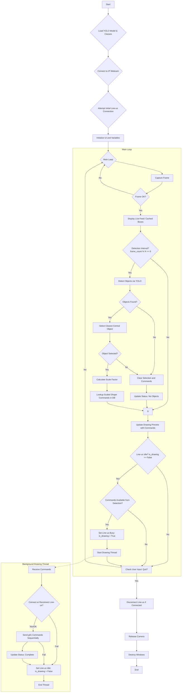

# The 3rd Approach - Shape Lookup

## The notes and the flowchart

### Process Explanation for Object-Based Drawing System

**1. Overview**

This system translates a live video feed into simplified line drawings executed by a Line-us robotic arm. Instead of complex image processing to extract contours from scratch for every frame, it employs an object detection model to identify known objects within the scene. Based on the detected object's class and perceived size, the system retrieves corresponding pre-defined drawing commands (scaled appropriately) from a shape database and sends them to the Line-us plotter. This approach prioritizes recognition and mapping over fine-grained contour tracing, aiming for speed and robustness in generating simple, representative drawings of detected subjects.

**2. System Initialization**

Upon startup, the system performs the following initialization steps:

-   **Load Object Detection Model:** A pre-trained YOLOv3-tiny object detection model (`.weights` and `.cfg` files) is loaded into memory using OpenCV's Deep Neural Network (DNN) module. The corresponding class names (from `coco.names`) are also loaded.
-   **Connect to Video Source:** An attempt is made to connect to the specified IP Webcam URL (`http://192.168.100.76:8080/video`) to establish the video input stream.
-   **Connect to Line-us:** An initial attempt is made to establish a TCP socket connection with the Line-us plotter at its specified hostname (`l1i2n3e4u5s6.local`) on port 1337. Success or failure is noted, but the program proceeds regardless (connection will be retried later if needed).
-   **Initialize Variables:** Global state variables, such as the drawing status flag (`is_drawing`) and status message, are initialized.
-   **Setup Visualization:** OpenCV windows are created for displaying the live camera feed and a preview of the drawing commands.

**3. Real-time Processing Loop**

The system then enters a continuous loop, processing video frames as they arrive:

-   **Frame Acquisition:** A frame is read from the IP Webcam video stream.
-   **Performance Optimization (Frame Skipping):** To improve real-time performance and reduce redundant processing, object detection is performed only on every Nth frame (controlled by `FRAME_PROCESS_INTERVAL`, e.g., every 2nd or 3rd frame). Visualization continues on every frame, using cached detection results.
-   **Object Detection (Conditional):** If the current frame is designated for processing:
    -   The frame is preprocessed into a blob suitable for the YOLO model (resized to 320x320, scaled, color channels potentially swapped).
    -   The blob is passed through the loaded YOLO network (`net.forward()`).
    -   The network outputs potential object detections. These outputs are processed to filter detections below a confidence threshold (`CONFIDENCE_THRESHOLD`) and Non-Maximum Suppression (`NMS_THRESHOLD`) is applied to eliminate overlapping boxes for the same object.
    -   A list of detected objects, each containing a class label (e.g., "cup", "person"), bounding box coordinates (`[x, y, w, h]`), and confidence score, is generated. This list updates a cache (`detected_objects_cache`) used for visualization on non-processing frames.
-   **Target Selection:** From the list of currently detected objects (if any from the current processing cycle), the system identifies the object whose bounding box center is geometrically closest to the center of the video frame. This focuses the system on the most central subject, effectively ignoring peripheral objects or background clutter.
-   **Dynamic Scaling:** If a central target object is selected:
    -   A scale factor is calculated based on the relative size of the object's bounding box. The ratio of the bounding box diagonal to the image diagonal is mapped to a predefined range (e.g., 1.0 to 3.0, controlled by `MIN/MAX_SCALE_FACTOR` and `MIN/MAX_DIAG_RATIO`). Larger objects closer to the camera result in a larger scale factor.
-   **Shape Database Mapping:**
    -   The class label of the selected object (e.g., "cup") and the calculated `scale_factor` are used to query a pre-defined shape database (imported from `shapes_db.py`).
    -   The `get_gcode` function within the database retrieves a list of pre-programmed drawing commands `[(x1, y1, z1), (x2, y2, z2), ...]`. These commands are already scaled by the `scale_factor` within the database function and represent the sequence of moves required to draw a simplified version of the detected object using Line-us coordinates (e.g., 0-2000 range, Z=0 for pen down, Z=1000 for pen up).
-   **Drawing Execution (Automatic Trigger):**
    -   The system checks the `is_drawing` flag. This flag indicates whether the Line-us is currently busy executing a previous drawing command sequence.
    -   If a central object was detected, its corresponding command list was successfully retrieved, AND the Line-us is currently idle (`is_drawing == False`), the system automatically initiates the drawing process.
    -   The `is_drawing` flag is set to `True`.
    -   A new background thread (`threading.Thread`) is created and started, targeting the `execute_lineus_drawing` function. The retrieved command list and Line-us hostname are passed to this thread. This ensures the main loop remains responsive and continues processing video frames while the potentially time-consuming drawing occurs concurrently.
-   **Line-us Command Execution (Background Thread):**
    -   The `execute_lineus_drawing` function, running in its separate thread:
        -   Attempts to connect/reconnect to the Line-us device if not already connected.
        -   Iterates through the received list of `(x, y, z)` commands.
        -   For each command, it calls the `LineUs.g01(x, y, z)` method, sending the instruction to the robot arm.
        -   Waits for the 'ok' response from Line-us after each `g01` command before sending the next (handled within the `LineUs` class).
        -   Upon completion or encountering a connection/communication error, it sets the global `is_drawing` flag back to `False`, making the system ready to accept the next drawing task. It also updates the global `status_message`.
-   **Visualization:** On every loop iteration:
    -   The `Live Camera Feed with Detections` window displays the current camera frame. Bounding boxes from the _last successful detection cycle_ (using `detected_objects_cache`) are overlaid, with the currently selected central object highlighted differently.
    -   The `Drawing Preview` window displays a visual representation of the command list generated for the _currently selected_ central object (or is blank if no object is selected). This preview is generated by the `draw_commands_on_canvas` function.
    -   The current system status (`status_message`) is displayed on the preview window.

**4. Termination**

-   The main loop continuously checks for keyboard input using `cv2.waitKey(1)`.
-   If the 'q' key is pressed, the loop terminates.
-   During cleanup, the video capture is released, an attempt is made to disconnect the Line-us cleanly (optionally sending a final pen-up command), any active drawing thread is waited upon briefly, and all OpenCV windows are destroyed.

**5. Key Strengths of this Approach**

-   **Speed:** By eliminating per-frame contour extraction and relying on faster object detection (especially YOLOv3-tiny) and pre-defined shapes, the processing pipeline is significantly faster than the previous contour-based methods. Frame skipping further enhances performance.
-   **Robustness to Clutter:** Object detection inherently focuses on recognized objects, naturally ignoring background noise, textures, or unrelated items that might have generated contours in the previous approach.
-   **Focus:** The central object selection logic ensures the system draws the main subject in the camera's view.
-   **Simplicity:** The core drawing logic maps directly from a detected class name to a pre-defined, scalable drawing sequence, simplifying the generation process compared to simplifying complex, noisy contours.
-   **Orientation Invariance (Partial):** Standard object detection models like YOLO are trained on diverse datasets and exhibit reasonable robustness to variations in object orientation, although extreme or unusual angles might still pose challenges.

---

### Flowchart (Mermaid)



## The program

```python
import cv2
import numpy as np
import time
import math
import socket
import threading
import os

# --- Import the shapes database ---
try:
    # Ensure shapes_db.py is in the same directory
    from shapes_db import get_gcode, PEN_UP_Z, PEN_DOWN_Z, DRAW_AREA_WIDTH, DRAW_AREA_HEIGHT
except ImportError:
    print("ERROR: Could not import from shapes_db.py.")
    print("Make sure shapes_db.py is in the same directory as this script.")
    exit()

# --- Configuration ---
IP_WEBCAM_URL = "http://192.168.100.76:8080/video" # <-- Camera URL
LINE_US_HOSTNAME = 'l1i2n3e4u5s6.local' # <-- Line-us Hostname

# --- Object Detection Model Files (Using YOLOv3-tiny) ---
MODEL_CONFIG = "yolov3-tiny.cfg"
MODEL_WEIGHTS = "yolov3-tiny.weights"
CLASS_NAMES_FILE = "coco.names"
# Check if files exist
if not all(os.path.exists(f) for f in [MODEL_CONFIG, MODEL_WEIGHTS, CLASS_NAMES_FILE]):
    print("ERROR: Model files (.cfg, .weights, .names) not found.")
    print(f"Required: {MODEL_CONFIG}, {MODEL_WEIGHTS}, {CLASS_NAMES_FILE}")
    print("Please download the specified YOLOv3-tiny model files.")
    exit()

# Object Detection Parameters (Fixed)
CONFIDENCE_THRESHOLD = 0.4 # Minimum probability to filter weak detections
NMS_THRESHOLD = 0.3       # Non-maximum suppression threshold
YOLO_INPUT_SIZE = (320, 320) # Smaller input size for potential speed increase

# Scaling Parameters for Database Shapes
MIN_SCALE_FACTOR = 1.0
MAX_SCALE_FACTOR = 3.0
MIN_DIAG_RATIO = 0.1 # Smallest object size (relative to image diagonal) for min scale
MAX_DIAG_RATIO = 0.8 # Largest object size for max scale

# Performance Tuning
FRAME_PROCESS_INTERVAL = 2 # Process every Nth frame for detection

# Visualization Parameters
VIS_CANVAS_SIZE = (800, 600) # Preview window size
VIS_PADDING = 50
VIS_PEN_DOWN_COLOR = (0, 0, 0)
VIS_LINE_THICKNESS = 1
VIS_BOX_COLOR = (0, 255, 0) # Green for detected boxes
VIS_SELECTED_BOX_COLOR = (0, 0, 255) # Red for the selected box

# --- Global Variables ---
my_line_us_instance = None
is_drawing = False # Flag to indicate if Line-us is busy
status_message = "Status: Initializing..."
net = None
output_layers = None
classes = None
drawing_thread = None # Keep track of the drawing thread

# --- LineUs Class (Simplified - Assumes it's defined as before) ---
class LineUs:
    """Handles communication with the Line-us device."""
    def __init__(self, line_us_name):
        self.__line_us = socket.socket(socket.AF_INET, socket.SOCK_STREAM)
        self.__line_us.settimeout(5.0) # Connection/operation timeout
        try:
            self.__line_us.connect((line_us_name, 1337))
            self.__connected = True
            self.__hello_message = self.__read_response()
        except (socket.error, socket.timeout) as e:
            print(f"Error connecting to Line-us '{line_us_name}': {e}")
            self.__connected = False
            self.__hello_message = b'Connection Failed'
            raise

    @property
    def is_connected(self):
        return self.__connected

    def get_hello_string(self):
        return self.__hello_message.decode() if self.__connected else 'Not connected'

    def disconnect(self):
        if not self.__connected: return
        try:
            # Send pen up before closing? Optional safety.
            # self.g01(0, 0, PEN_UP_Z) # Move to 0,0 lifted
            self.__line_us.close()
        except socket.error as e:
            print(f"Socket error during disconnect: {e}")
        self.__connected = False
        print("Line-us connection closed.")

    def g01(self, x, y, z):
        if not self.__connected: raise ConnectionError("Not connected to Line-us")
        x_int, y_int, z_int = int(round(x)), int(round(y)), int(round(z))
        cmd = f'G01 X{x_int} Y{y_int} Z{z_int}'.encode()
        self.__send_command(cmd)
        response = self.__read_response()
        # Allow non-'ok' responses silently for continuous operation
        # if response.lower() != b'ok':
        #     print(f"Warning: Unexpected response: {response.decode()}")

    def __read_response(self):
        if not self.__connected: return b''
        line = b''; start_time = time.time()
        try:
            while True:
                char = self.__line_us.recv(1)
                if not char: raise socket.error("Connection closed by peer")
                if char != b'\x00': line += char
                elif char == b'\x00': break
                if time.time() - start_time > self.__line_us.gettimeout(): raise socket.timeout("Timeout reading")
        except (socket.timeout, socket.error) as e:
            print(f"Socket error/timeout during read: {e}")
            self.__connected = False; raise
        return line

    def __send_command(self, command):
        if not self.__connected: return
        try:
            command += b'\x00'
            self.__line_us.sendall(command)
        except socket.error as e:
            print(f"Socket error during send: {e}")
            self.__connected = False; raise

# --- Processing Functions ---

def load_object_detection_model():
    """Loads the YOLO model and class names."""
    global net, output_layers, classes
    print(f"Loading object detection model ({MODEL_CONFIG})...")
    try:
        net = cv2.dnn.readNet(MODEL_WEIGHTS, MODEL_CONFIG)
        net.setPreferableBackend(cv2.dnn.DNN_BACKEND_OPENCV)
        net.setPreferableTarget(cv2.dnn.DNN_TARGET_CPU)
        layer_names = net.getLayerNames()
        out_layer_indices = net.getUnconnectedOutLayers()
        if isinstance(out_layer_indices, np.ndarray):
             if out_layer_indices.ndim > 1: out_layer_indices = out_layer_indices.flatten()
             output_layers = [layer_names[i - 1] for i in out_layer_indices if 0 < i <= len(layer_names)]
        elif isinstance(out_layer_indices, int):
             if 0 < out_layer_indices <= len(layer_names): output_layers = [layer_names[out_layer_indices - 1]]
             else: output_layers = []
        else: print(f"Warning: Unexpected layers format: {type(out_layer_indices)}"); output_layers = []
        if not output_layers: print("Error: Could not determine output layers."); exit()
        with open(CLASS_NAMES_FILE, "r") as f: classes = [line.strip() for line in f.readlines()]
        print(f"Model loaded. Output layers: {output_layers}. Classes: {len(classes)}.")
    except cv2.error as e: print(f"OpenCV Error loading model: {e}"); exit()
    except Exception as e: print(f"Error loading model/class names: {e}"); exit()

def detect_objects(frame):
    """Performs object detection. Uses fixed global thresholds and input size."""
    if net is None or output_layers is None or classes is None: return []
    height, width = frame.shape[:2]
    blob = cv2.dnn.blobFromImage(frame, 1/255.0, YOLO_INPUT_SIZE, swapRB=True, crop=False)
    net.setInput(blob)
    try: layer_outputs = net.forward(output_layers)
    except cv2.error as e: print(f"Error during forward pass: {e}"); return []
    boxes, confidences, class_ids = [], [], []
    for output in layer_outputs:
        for detection in output:
            scores = detection[5:]
            class_id = np.argmax(scores)
            confidence = scores[class_id]
            if confidence > CONFIDENCE_THRESHOLD:
                center_x, center_y = int(detection[0]*width), int(detection[1]*height)
                w, h = int(detection[2]*width), int(detection[3]*height)
                x, y = int(center_x - w/2), int(center_y - h/2)
                boxes.append([x, y, w, h]); confidences.append(float(confidence)); class_ids.append(class_id)
    indices = cv2.dnn.NMSBoxes(boxes, confidences, CONFIDENCE_THRESHOLD, NMS_THRESHOLD)
    detected_objects = []
    if len(indices) > 0:
        final_indices = indices.flatten() if isinstance(indices, np.ndarray) else [indices]
        for i in final_indices:
             if 0 <= i < len(boxes):
                 box = boxes[i]
                 label = str(classes[class_ids[i]]) if 0 <= class_ids[i] < len(classes) else "Unknown"
                 detected_objects.append({"label": label, "box": box, "confidence": confidences[i]})
    return detected_objects

def calculate_scale_factor(box, img_dims):
    """Calculates scale factor based on bounding box diagonal ratio."""
    img_h, img_w = img_dims
    if img_h <= 0 or img_w <= 0: return MIN_SCALE_FACTOR
    img_diag = math.sqrt(img_h**2 + img_w**2)
    x, y, w, h = box
    box_diag = math.sqrt(w**2 + h**2)
    diag_ratio = box_diag / img_diag
    clamped_ratio = max(MIN_DIAG_RATIO, min(MAX_DIAG_RATIO, diag_ratio))
    if (MAX_DIAG_RATIO - MIN_DIAG_RATIO) <= 0: return MIN_SCALE_FACTOR
    normalized_ratio = (clamped_ratio - MIN_DIAG_RATIO) / (MAX_DIAG_RATIO - MIN_DIAG_RATIO)
    scale_factor = MIN_SCALE_FACTOR + normalized_ratio * (MAX_SCALE_FACTOR - MIN_SCALE_FACTOR)
    return scale_factor

def execute_lineus_drawing(commands_to_draw, hostname):
    """Connects (if needed), sends commands, disconnects on error. Runs in a thread."""
    global my_line_us_instance, is_drawing, status_message
    if not commands_to_draw:
        print("Draw thread started with no commands."); is_drawing = False; status_message = "Status: Idle."; return

    status_message = f"Status: Connecting to {hostname}..."
    print(status_message)
    connection_error = False
    try:
        # Connect or reconnect if necessary
        if my_line_us_instance is None or not my_line_us_instance.is_connected:
             if my_line_us_instance: my_line_us_instance.disconnect() # Clean close
             my_line_us_instance = LineUs(hostname) # Raises error on failure
             print(f"Connected: {my_line_us_instance.get_hello_string()}")
        # else: print("Already connected.") # Assume connected

        status_message = "Status: Drawing..."; print(status_message)
        start_time = time.time()
        # --- Send Commands ---
        for i, cmd_tuple in enumerate(commands_to_draw):
             x, y, z = cmd_tuple
             my_line_us_instance.g01(x, y, z) # Send move command
        end_time = time.time()
        # --- Update status AFTER drawing completes ---
        status_message = f"Status: Idle. Last draw: {len(commands_to_draw)} cmds ({end_time - start_time:.1f}s)"
        print(status_message.replace("Idle. L", "L")) # Print completion time

    except (socket.error, socket.timeout, ConnectionError, AttributeError) as e:
        status_message = f"Status: Line-us Error - {e}"
        print(f"Line-us Error during drawing: {e}")
        connection_error = True
    except Exception as e:
        status_message = f"Status: Unexpected Draw Error - {e}"
        print(f"Unexpected error during Line-us drawing: {e}")
        connection_error = True
    finally:
        if connection_error and my_line_us_instance:
            my_line_us_instance.disconnect() # Ensure disconnected on error
            my_line_us_instance = None
        is_drawing = False # --- Set idle AFTER completion or error ---

def draw_commands_on_canvas(canvas, command_list, padding, pen_down_color, thickness):
    """Parses the command list [(x,y,z),...] and draws the path onto the canvas."""
    canvas.fill(255) # Clear canvas
    if not command_list: return canvas
    canvas_h, canvas_w = canvas.shape[:2]
    plotter_w, plotter_h = DRAW_AREA_WIDTH, DRAW_AREA_HEIGHT
    points_xy = [(x,y) for x,y,z in command_list]
    if not points_xy: return canvas
    min_x, min_y = np.min(points_xy, axis=0); max_x, max_y = np.max(points_xy, axis=0)
    draw_w = max(max_x - min_x, 1.0); draw_h = max(max_y - min_y, 1.0)
    scale = min((canvas_w-2*padding)/draw_w, (canvas_h-2*padding)/draw_h) if draw_w>0 and draw_h>0 else 1.0
    offset_x = padding + ((canvas_w - 2*padding) - draw_w * scale) / 2.0
    offset_y = padding + ((canvas_h - 2*padding) - draw_h * scale) / 2.0
    def map_coords(gx, gy): px = int(offset_x + (gx - min_x) * scale); py = int(offset_y + (gy - min_y) * scale); return px, py
    last_x, last_y = None, None; pen_down = False
    for x, y, z in command_list:
        current_px, current_py = map_coords(x, y)
        is_pen_down_command = (z == PEN_DOWN_Z)
        if last_x is not None and is_pen_down_command and pen_down:
            last_px, last_py = map_coords(last_x, last_y)
            cv2.line(canvas, (last_px, last_py), (current_px, current_py), pen_down_color, thickness)
        last_x, last_y = x, y; pen_down = is_pen_down_command
    return canvas

# --- Main Execution Loop ---
if __name__ == "__main__":
    load_object_detection_model()

    print("Starting Continuous Object Detection to LineUs Control...")
    print(f"Attempting to connect to IP Webcam at: {IP_WEBCAM_URL}")
    print(f"Line-us Hostname: {LINE_US_HOSTNAME}")
    print("Press 'q' to quit.")

    # --- Attempt Initial Line-us Connection ---
    try:
        print("Attempting initial connection to Line-us...")
        my_line_us_instance = LineUs(LINE_US_HOSTNAME)
        status_message = f"Status: Idle. Connected to {LINE_US_HOSTNAME}"
        print(f"Initial connection successful: {my_line_us_instance.get_hello_string()}")
    except Exception as e:
        status_message = f"Status: Line-us conn failed on startup: {e}. Will retry."
        print(status_message)

    cap = cv2.VideoCapture(IP_WEBCAM_URL)
    if not cap.isOpened(): print(f"Error: Cannot open IP Webcam stream at {IP_WEBCAM_URL}"); exit()
    print("Successfully connected to IP Webcam.")

    preview_canvas = np.ones((VIS_CANVAS_SIZE[1], VIS_CANVAS_SIZE[0], 3), dtype=np.uint8) * 255
    cv2.namedWindow('Drawing Preview')
    cv2.namedWindow('Live Camera Feed with Detections')

    drawing_thread = None
    frame_count = 0
    detected_objects_cache = []
    current_preview_commands = [] # Commands for the current preview

    while True:
        # 1. Capture Frame
        ret, frame = cap.read()
        if not ret: time.sleep(0.1); continue

        frame_for_display = frame.copy()
        img_h, img_w = frame.shape[:2]
        if img_h == 0 or img_w == 0: continue
        img_center_x, img_center_y = img_w // 2, img_h // 2

        frame_count += 1
        selected_object = None
        commands_for_this_frame = []

        # 2. Process only every Nth frame
        if frame_count % FRAME_PROCESS_INTERVAL == 0:
            # 3. Detect Objects
            detected_objects = detect_objects(frame)
            detected_objects_cache = detected_objects # Update cache for display

            # 4. Select Closest Object
            min_dist = float('inf')
            if detected_objects:
                for obj in detected_objects:
                    x, y, w, h = obj['box']
                    box_center_x, box_center_y = x + w // 2, y + h // 2
                    distance = math.sqrt((box_center_x - img_center_x)**2 + (box_center_y - img_center_y)**2)
                    if distance < min_dist:
                        min_dist = distance
                        selected_object = obj

            # 5. Generate Commands for Selected Object (if any)
            if selected_object:
                object_label = selected_object['label']
                scale_factor = calculate_scale_factor(selected_object['box'], (img_h, img_w))
                commands_for_this_frame = get_gcode(object_label, scale_factor)
                current_preview_commands = commands_for_this_frame # Update preview

                # 6. *** Trigger Drawing Automatically if Idle ***
                if not is_drawing and commands_for_this_frame:
                    print(f"\nDetected '{object_label}', Line-us idle. Starting draw...")
                    is_drawing = True # Set busy flag immediately
                    status_message = f"Status: Sending {object_label}..."
                    # Start the drawing thread with the commands for *this* frame
                    drawing_thread = threading.Thread(
                        target=execute_lineus_drawing,
                        args=(commands_for_this_frame, LINE_US_HOSTNAME),
                        daemon=True)
                    drawing_thread.start()
                elif not is_drawing: # Detected object, but Line-us is idle (no need to update status if drawing)
                     status_message = f"Status: Ready. Found {object_label} (Scale:{scale_factor:.2f})."

            else: # No object selected in this processing cycle
                current_preview_commands = [] # Clear preview if nothing selected
                if not is_drawing: # Update status only if idle
                    status_message = "Status: Idle. No target object found."

        # 7. Draw detection boxes from cache
        if detected_objects_cache:
             is_selected_object_still_visible = False
             for obj in detected_objects_cache:
                 x, y, w, h = obj['box']
                 is_this_the_selected_one = (selected_object is not None and obj["label"] == selected_object["label"] and obj["box"] == selected_object["box"])
                 if is_this_the_selected_one: is_selected_object_still_visible = True
                 color = VIS_SELECTED_BOX_COLOR if is_this_the_selected_one else VIS_BOX_COLOR
                 cv2.rectangle(frame_for_display, (x, y), (x + w, y + h), color, 2)
                 label_text = f"{obj['label']}: {obj['confidence']:.2f}"
                 cv2.putText(frame_for_display, label_text, (x, y - 5), cv2.FONT_HERSHEY_SIMPLEX, 0.5, color, 1)
             # Update status if selected object is lost while idle
             if selected_object is None and not is_drawing and status_message.startswith("Status: Ready"):
                  status_message = "Status: Idle. Target lost."

        # 8. Visualize Drawing Preview (shows latest *potential* drawing)
        preview_canvas = draw_commands_on_canvas(
            preview_canvas, current_preview_commands, VIS_PADDING,
            VIS_PEN_DOWN_COLOR, VIS_LINE_THICKNESS
        )
        preview_h, preview_w = preview_canvas.shape[:2]
        # Add status message (reflecting drawing state)
        current_display_status = status_message
        if is_drawing and not status_message.startswith("Status: Drawing"): # Ensure "Drawing..." persists
             current_display_status = "Status: Drawing..." # Override if thread hasn't updated yet
        cv2.putText(preview_canvas, current_display_status, (10, preview_h - 10), cv2.FONT_HERSHEY_SIMPLEX, 0.5, (100, 100, 100), 1)

        # 9. Display Windows
        cv2.imshow('Live Camera Feed with Detections', frame_for_display)
        cv2.imshow('Drawing Preview', preview_canvas)

        # 10. Handle Quit Key
        key = cv2.waitKey(1) & 0xFF
        if key == ord('q'):
            print("Quit key pressed. Exiting.")
            break

    # Cleanup
    print("Releasing camera and closing windows...")
    cap.release()
    if my_line_us_instance and my_line_us_instance.is_connected:
        print("Disconnecting from Line-us...")
        # Optionally send pen up command before disconnect
        try:
             if not is_drawing: # Only if not actively drawing
                 my_line_us_instance.g01(0, 0, PEN_UP_Z)
        except Exception as e:
             print(f"Error sending final pen up: {e}")
        my_line_us_instance.disconnect()
    if drawing_thread and drawing_thread.is_alive():
         print("Waiting for drawing thread to finish...")
         drawing_thread.join(timeout=3.0) # Wait slightly longer
    cv2.destroyAllWindows()
    print("Done.")
```

