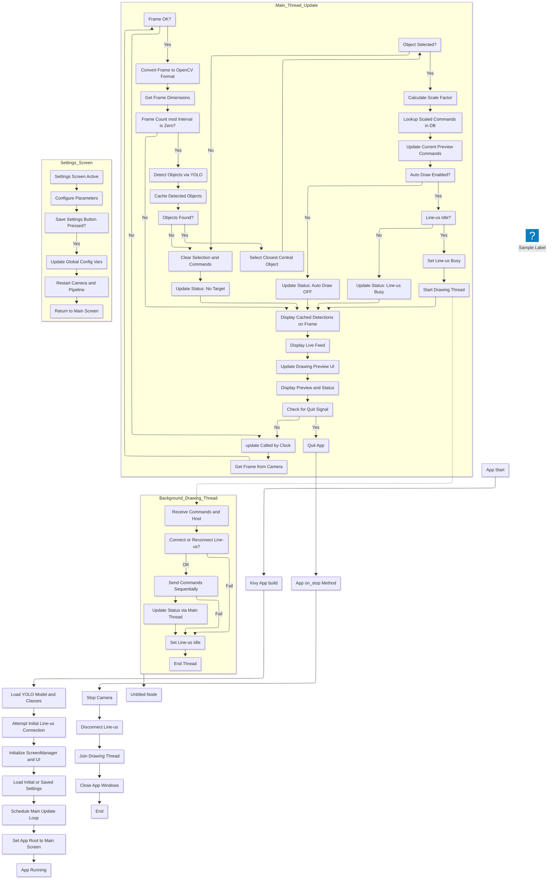

# The Application Detailed

## The notes and the flowchart

### Process Explanation for Kivy Android App (Object Detection + Database)

**1. Overview**

This system is implemented as a mobile application using the Kivy framework, designed to run on an Android device. It utilizes the device's camera feed, processes it to detect objects using a pre-trained model, maps the detected central object to a simplified drawing from a database, and automatically sends these drawing commands to a connected Line-us plotter when the plotter is idle. The application provides a graphical user interface for viewing the camera feed, previewing the drawing, seeing the status, and configuring parameters.

**2. Application Initialization (Kivy `build` Method)**

The application starts by setting up its core components and UI:
*   **Kivy App Setup:** The Kivy application framework is initialized, including loading necessary modules and widgets.
*   **Model Loading:** The YOLOv3-tiny object detection model (`.cfg`, `.weights`, `.names` files) is loaded into memory using OpenCV's DNN module. File paths are handled relative to the application's directory, which is important for packaging.
*   **Screen Manager:** A `ScreenManager` is set up to handle different views (e.g., the main camera/drawing screen and a settings screen).
*   **UI Creation:** The main `MainScreen` and `SettingsScreen` are created and added to the `ScreenManager`. The `MainScreen` contains the main layout with widgets for displaying the camera feed, drawing preview, and status.
*   **Initial Settings:** Default configuration parameters are loaded.
*   **Line-us Connection:** An attempt is made to establish an initial TCP socket connection to the Line-us device. The status of this attempt is reflected in the UI.
*   **Camera Initialization:** The appropriate camera widget is initialized based on the selected camera source (device camera using Kivy's `Camera` or an IP webcam stream using a custom `MJPEGCamera`). The camera is set to start playing.
*   **Scheduling Update Loop:** Kivy's `Clock.schedule_interval` is used to schedule the main processing logic (`update` method) to run at a regular interval (e.g., 10 times per second). This method will handle frame processing and UI updates.

**3. Real-time Processing Loop (`update` Method, Scheduled by Kivy Clock)**

The `update` method runs periodically on Kivy's main thread, handling frame processing and UI updates:

*   **Frame Acquisition:** The latest frame is obtained from the active camera widget's texture.
*   **Texture to OpenCV Conversion:** The Kivy `Texture` data is converted into a NumPy array format compatible with OpenCV. For the device camera, a rotation might be applied to correct orientation.
*   **Performance Optimization (Frame Skipping):** Object detection is a computationally intensive task. To maintain responsiveness, the full detection and command generation process is executed only on every Nth frame (controlled by `FRAME_PROCESS_INTERVAL`).
*   **Object Detection (Conditional):** If the current frame is scheduled for processing:
    *   The OpenCV frame is passed to the `detect_objects` function.
    *   The YOLO model runs on the frame, identifying objects, their bounding boxes, and confidence scores using pre-set thresholds.
    *   The list of detected objects is stored in a cache (`detected_objects_cache`) for display purposes on subsequent frames.
*   **Target Selection:** From the objects detected in the current processing cycle (if any), the object whose bounding box center is closest to the center of the frame is identified as the target object.
*   **Dynamic Scaling:** If a target object is selected, a scale factor (between 1.0 and 3.0) is calculated based on the ratio of the object's bounding box diagonal to the image diagonal. This scales the pre-defined shape from the database.
*   **Shape Database Mapping:**
    *   The class label of the selected object (e.g., "cup") and the calculated scale factor are used to query the `shapes_db.py` database via the `get_gcode()` function.
    *   The database returns a list of `(x, y, z)` commands representing the scaled, pre-defined shape for that object. This list updates the `current_preview_commands`.
*   **Drawing Execution (Automatic Trigger):**
    *   If a target object was detected in the current cycle, its commands were generated, AND the Line-us is currently idle (`is_drawing == False`), the system automatically triggers the drawing process.
    *   The `is_drawing` flag is set to `True` (signaling busy).
    *   A new background thread (`threading.Thread`) is started, targeting `execute_lineus_drawing_kivy`. The generated command list, Line-us hostname, and a reference to the Kivy app instance are passed to this thread.
*   **Line-us Command Execution (Background Thread - `execute_lineus_drawing_kivy`):**
    *   This function runs in a separate thread to prevent the UI from freezing.
    *   It connects to the Line-us (if not already connected).
    *   It iterates through the command list, sending each `(x, y, z)` command to the Line-us using `my_line_us_instance.g01()`.
    *   Crucially, it uses `App.get_running_app().update_status_message_mainthread()` to safely update the UI status label from the background thread.
    *   Upon completing the command list or encountering an error, it sets the global `is_drawing` flag back to `False`, making the system ready for the next drawing task, and updates the status message via the main thread.

*   **Visualization Updates (Main Thread):** On every `update` cycle:
    *   The live camera feed is displayed by the camera widget.
    *   Bounding boxes from the `detected_objects_cache` are overlaid onto a copy of the frame for display, with the selected object highlighted. This overlaid frame is then displayed in an `Image` widget (or drawn directly on the camera widget's canvas, depending on implementation detail).
    *   The `DrawingPreviewWidget` is updated with the `current_preview_commands`, causing it to redraw the preview of the shape using Kivy's drawing instructions on its canvas.
    *   The `status_message` is displayed in the status label widget.

**4. Settings Screen**

A separate `SettingsScreen` provides UI elements (Spinners, TextInputs, Sliders) for configuring various parameters (camera source, webcam details, detection thresholds, YOLO input size, frame interval, scaling bounds). Saving settings updates the global configuration variables and triggers a restart of the camera and processing pipeline to apply changes.

**5. Termination (`on_stop` Method)**

When the application is closed:
*   The `on_stop` method is called.
*   The camera is stopped.
*   An attempt is made to disconnect the Line-us cleanly (optionally sending a final pen-up command if not busy drawing).
*   Any active drawing thread is given a brief moment to finish using `thread.join()`.
*   All Kivy windows are automatically closed.

**6. Key Characteristics of this Application Approach**

*   **Mobile Portability:** Runs on an Android device, making the system portable.
*   **Integrated UI:** Provides a touch-friendly interface for interaction and monitoring.
*   **Automatic Operation:** Automatically triggers drawing when a central object is detected and the Line-us is idle.
*   **Busy State Management:** Prevents sending commands while the Line-us is already drawing using the `is_drawing` flag.
*   **Threaded Drawing:** Ensures UI responsiveness by performing Line-us communication in a background thread.
*   **Parameter Configurability:** Allows tuning parameters via a settings screen (though changes require saving and restarting camera).

---

### Flowchart (Mermaid)



## The program

```python
# main.py
import os
os.environ["KIVY_VIDEO"] = "ffpyplayer"
# Set Kivy environment variables before importing Kivy (optional, for logging)
# os.environ['KIVY_LOG_LEVEL'] = 'debug'

import kivy
kivy.require('2.0.0') # Specify Kivy version if necessary

from kivy.app import App
from kivy.uix.boxlayout import BoxLayout
from kivy.uix.image import Image
from kivy.uix.label import Label
from kivy.uix.button import Button # Will add a button later if needed
from kivy.uix.widget import Widget
from kivy.graphics import Color, Line, RoundedRectangle
from kivy.graphics.texture import Texture
from kivy.clock import Clock
from kivy.utils import platform
from kivy.logger import Logger

from kivy.uix.camera import Camera
from kivy.uix.switch import Switch
from kivy.metrics import dp
from kivy.core.window import Window
from kivy.uix.screenmanager import ScreenManager, Screen
from kivy.uix.spinner import Spinner
from kivy.uix.slider import Slider
from kivy.uix.textinput import TextInput

import cv2
import numpy as np
import time
import math
import socket
import threading, requests

# --- Import the shapes database ---
try:
    from shapes_db import get_gcode, PEN_UP_Z, PEN_DOWN_Z, DRAW_AREA_WIDTH, DRAW_AREA_HEIGHT
except ImportError:
    Logger.error("APP: Could not import from shapes_db.py. Ensure it's in the same directory.")
    exit()

# --- Configuration (mostly from previous script) ---
# LINE_US_HOSTNAME will be set in the App's build method or from a config
# LINE_US_HOSTNAME_DEFAULT = 'l1i2n3e4u5s6.local'
LINE_US_HOSTNAME_DEFAULT = '192.168.4.1'

# --- Object Detection Model Files ---
# These paths will be relative to the app's directory when packaged
MODEL_CONFIG = "yolov3-tiny.cfg"
MODEL_WEIGHTS = "yolov3-tiny.weights"
CLASS_NAMES_FILE = "coco.names"

# Global settings (overriding current constants at runtime)
CAMERA_SOURCE = "phone"  # "phone" or "webcam"
WEBCAM_IP = ""
WEBCAM_PORT = ""
WEBCAM_PATH = ""

CONFIDENCE_THRESHOLD = 0.4
NMS_THRESHOLD = 0.3
YOLO_INPUT_SIZE = (320, 320)

MIN_SCALE_FACTOR = 1.0
MAX_SCALE_FACTOR = 3.0
MIN_DIAG_RATIO = 0.1
MAX_DIAG_RATIO = 0.8
FRAME_PROCESS_INTERVAL = 3 # Increased for potentially slower mobile camera/CPU

VIS_PADDING = 20 # Reduced padding for smaller preview on mobile
VIS_PEN_DOWN_COLOR_KIVY = (0, 0, 0, 1) # RGBA for Kivy
VIS_LINE_THICKNESS_KIVY = 1.5

# --- Global Variables ---
my_line_us_instance = None
is_drawing = False
status_message = "Status: Initializing..."
net = None
output_layers = None
classes = None
drawing_thread = None
detected_objects_cache = []
current_preview_commands = [] # Commands for the current preview

# --- LineUs Class (Identical to previous script) ---
class LineUs:
    def __init__(self, line_us_name):
        self.__line_us = socket.socket(socket.AF_INET, socket.SOCK_STREAM)
        self.__line_us.settimeout(10.0) # Increased timeout for mobile networks
        try:
            self.__line_us.connect((line_us_name, 1337))
            self.__connected = True
            self.__hello_message = self.__read_response()
        except (socket.error, socket.timeout) as e:
            Logger.error(f"LineUs: Error connecting to '{line_us_name}': {e}")
            self.__connected = False; self.__hello_message = b'Connection Failed'; raise
    @property
    def is_connected(self): return self.__connected
    def get_hello_string(self): return self.__hello_message.decode() if self.__connected else 'Not connected'
    def disconnect(self):
        if not self.__connected: return
        try: self.__line_us.close()
        except socket.error as e: Logger.error(f"LineUs: Socket error during disconnect: {e}")
        self.__connected = False; Logger.info("LineUs: Connection closed.")
    def g01(self, x, y, z):
        if not self.__connected: raise ConnectionError("LineUs: Not connected")
        x_int,y_int,z_int = int(round(x)),int(round(y)),int(round(z))
        cmd = f'G01 X{x_int} Y{y_int} Z{z_int}'.encode()
        self.__send_command(cmd)
        response = self.__read_response()
        if response.lower() != b'ok': Logger.warning(f"LineUs: Unexpected response: {response.decode()}")
    def __read_response(self):
        if not self.__connected: return b''
        line = b''; start_time = time.time()
        try:
            while True:
                char = self.__line_us.recv(1)
                if not char: raise socket.error("LineUs: Connection closed by peer")
                if char != b'\x00': line += char
                elif char == b'\x00': break
                if time.time() - start_time > self.__line_us.gettimeout(): raise socket.timeout("LineUs: Timeout reading")
        except (socket.timeout, socket.error) as e:
            Logger.error(f"LineUs: Socket error/timeout during read: {e}"); self.__connected = False; raise
        return line
    def __send_command(self, command):
        if not self.__connected: return
        try: command += b'\x00'; self.__line_us.sendall(command)
        except socket.error as e: Logger.error(f"LineUs: Socket error during send: {e}"); self.__connected = False; raise

# --- Processing Functions (Adapted for Kivy paths if needed) ---
def get_app_path(*args):
    """Helper to get path relative to app directory, works for dev and packaged app."""
    return os.path.join(App.get_running_app().directory, *args)

def load_object_detection_model_kivy():
    global net, output_layers, classes
    Logger.info(f"APP: Loading object detection model...")
    try:
        # Use get_app_path for model files
        config_path = get_app_path(MODEL_CONFIG)
        weights_path = get_app_path(MODEL_WEIGHTS)
        names_path = get_app_path(CLASS_NAMES_FILE)

        if not all(os.path.exists(p) for p in [config_path, weights_path, names_path]):
            Logger.error("APP: One or more model files not found in app directory.")
            # Attempt to copy from assets if on Android and files missing (Buildozer specific)
            if platform == 'android':
                from android.storage import primary_external_storage_path
                from shutil import copyfile
                app_files_dir = App.get_running_app().user_data_dir # Or other writable location
                Logger.info(f"APP: Android platform detected. App files dir: {app_files_dir}")
                # This part is tricky and might need adjustment based on how Buildozer packages.
                # For now, assume files are directly accessible via get_app_path or are
                # in a location OpenCV can read. If not, explicit copying is needed.
                # A common strategy is to copy them from read-only assets to a writable dir on first run.
                # This example assumes they are accessible directly.
            # else: # If not on Android and files missing, it's a setup error
            #     return False # Indicate failure

        net = cv2.dnn.readNet(weights_path, config_path)
        net.setPreferableBackend(cv2.dnn.DNN_BACKEND_OPENCV)
        net.setPreferableTarget(cv2.dnn.DNN_TARGET_CPU)
        layer_names = net.getLayerNames()
        out_layer_indices = net.getUnconnectedOutLayers()
        if isinstance(out_layer_indices, np.ndarray):
             if out_layer_indices.ndim > 1: out_layer_indices = out_layer_indices.flatten()
             output_layers = [layer_names[i - 1] for i in out_layer_indices if 0 < i <= len(layer_names)]
        elif isinstance(out_layer_indices, int):
             if 0 < out_layer_indices <= len(layer_names): output_layers = [layer_names[out_layer_indices - 1]]
             else: output_layers = []
        else: Logger.warning(f"APP: Unexpected layers format: {type(out_layer_indices)}"); output_layers = []

        if not output_layers: Logger.error("APP: Could not determine output layers."); return False
        with open(names_path, "r") as f: classes = [line.strip() for line in f.readlines()]
        Logger.info(f"APP: Model loaded. Output layers: {output_layers}. Classes: {len(classes)}.")
        return True
    except cv2.error as e: Logger.error(f"APP: OpenCV Error loading model: {e}"); return False
    except Exception as e: Logger.error(f"APP: Error loading model/class names: {e}"); return False

# detect_objects and calculate_scale_factor are identical to previous script
def detect_objects(frame):
    if net is None or output_layers is None or classes is None: return []
    height, width = frame.shape[:2]
    blob = cv2.dnn.blobFromImage(frame, 1/255.0, YOLO_INPUT_SIZE, swapRB=True, crop=False)
    net.setInput(blob)
    try: layer_outputs = net.forward(output_layers)
    except cv2.error as e: Logger.error(f"APP: Error during forward pass: {e}"); return []
    boxes, confidences, class_ids = [], [], []
    for output in layer_outputs:
        for detection in output:
            scores = detection[5:]
            class_id = np.argmax(scores)
            confidence = scores[class_id]
            if confidence > CONFIDENCE_THRESHOLD:
                center_x,center_y = int(detection[0]*width),int(detection[1]*height)
                w,h = int(detection[2]*width),int(detection[3]*height)
                x,y = int(center_x - w/2),int(center_y - h/2)
                boxes.append([x,y,w,h]); confidences.append(float(confidence)); class_ids.append(class_id)
    indices = cv2.dnn.NMSBoxes(boxes,confidences,CONFIDENCE_THRESHOLD,NMS_THRESHOLD)
    detected_objects_list = []
    if len(indices) > 0:
        final_indices = indices.flatten() if isinstance(indices,np.ndarray) else [indices]
        for i in final_indices:
            if 0 <= i < len(boxes):
                box=boxes[i]; label=str(classes[class_ids[i]]) if 0<=class_ids[i]<len(classes) else "Unknown"
                detected_objects_list.append({"label":label,"box":box,"confidence":confidences[i]})
    return detected_objects_list

def calculate_scale_factor(box, img_dims):
    img_h,img_w = img_dims
    if img_h<=0 or img_w<=0: return MIN_SCALE_FACTOR
    img_diag = math.sqrt(img_h**2 + img_w**2)
    x,y,w,h = box; box_diag = math.sqrt(w**2+h**2)
    diag_ratio = box_diag/img_diag
    clamped_ratio = max(MIN_DIAG_RATIO,min(MAX_DIAG_RATIO,diag_ratio))
    if (MAX_DIAG_RATIO-MIN_DIAG_RATIO)<=0: return MIN_SCALE_FACTOR
    normalized_ratio = (clamped_ratio-MIN_DIAG_RATIO)/(MAX_DIAG_RATIO-MIN_DIAG_RATIO)
    scale_factor = MIN_SCALE_FACTOR + normalized_ratio*(MAX_SCALE_FACTOR-MIN_SCALE_FACTOR)
    return scale_factor

# execute_lineus_drawing is identical to previous script, but uses Kivy Logger
def execute_lineus_drawing_kivy(commands_to_draw, hostname, app_instance):
    global my_line_us_instance, is_drawing
    app_instance.update_status_message_mainthread(f"Status: Connecting to {hostname}...")
    Logger.info(f"LineUsThread: Connecting to {hostname}...")
    connection_error = False
    try:
        if my_line_us_instance is None or not my_line_us_instance.is_connected:
             if my_line_us_instance: my_line_us_instance.disconnect()
             my_line_us_instance = LineUs(hostname)
             Logger.info(f"LineUsThread: Connected: {my_line_us_instance.get_hello_string()}")
        app_instance.update_status_message_mainthread("Status: Drawing...")
        Logger.info("LineUsThread: Drawing...")
        start_time = time.time()
        for i, cmd_tuple in enumerate(commands_to_draw):
             x,y,z = cmd_tuple
             my_line_us_instance.g01(x,y,z)
        end_time = time.time()
        msg = f"Status: Idle. Last draw: {len(commands_to_draw)} cmds ({end_time-start_time:.1f}s)"
        app_instance.update_status_message_mainthread(msg)
        Logger.info(f"LineUsThread: {msg}")
    except (socket.error,socket.timeout,ConnectionError,AttributeError) as e:
        app_instance.update_status_message_mainthread(f"Status: Line-us Error - {e}")
        Logger.error(f"LineUsThread: Line-us Error: {e}"); connection_error=True
    except Exception as e:
        app_instance.update_status_message_mainthread(f"Status: Unexpected Draw Error - {e}")
        Logger.error(f"LineUsThread: Unexpected error: {e}"); connection_error=True
    finally:
        if connection_error and my_line_us_instance:
            my_line_us_instance.disconnect(); my_line_us_instance=None
        is_drawing = False

class DrawingPreviewWidget(Widget):
    def update_commands(self, new_commands):
        self.commands = new_commands
        self.canvas.clear()
        self.draw_preview()

    def draw_preview(self):
        self.canvas.clear()
        from kivy.graphics import PushMatrix, PopMatrix, Translate, Rectangle, Color, Ellipse, Line
        
        with self.canvas:
            PushMatrix()
            # Translate so subsequent drawing uses widget's local space
            Translate(self.x, self.y)
            
            # Draw background using local coordinates (0, 0)
            Color(1, 1, 1, 1)
            Rectangle(pos=(0, 0), size=self.size)
            
            if self.commands:
                widget_w, widget_h = self.width, self.height
                if widget_w <= 2 * VIS_PADDING or widget_h <= 2 * VIS_PADDING:
                    PopMatrix()
                    return

                points_xy = [(x, y) for x, y, z in self.commands]
                if points_xy:
                    min_x_db, min_y_db = np.min(points_xy, axis=0)
                    max_x_db, max_y_db = np.max(points_xy, axis=0)
                    draw_w_db = max(max_x_db - min_x_db, 1.0)
                    draw_h_db = max(max_y_db - min_y_db, 1.0)

                    scale = min((widget_w - 2 * VIS_PADDING) / draw_w_db,
                                (widget_h - 2 * VIS_PADDING) / draw_h_db)
                    offset_x = VIS_PADDING + ((widget_w - 2 * VIS_PADDING) - draw_w_db * scale) / 2.0
                    offset_y = VIS_PADDING + ((widget_h - 2 * VIS_PADDING) - draw_h_db * scale) / 2.0

                    def map_coords(gx, gy):
                        px = offset_x + (gx - min_x_db) * scale
                        py = widget_h - (offset_y + (gy - min_y_db) * scale)
                        return px, py

                    last_px, last_py = None, None
                    pen_is_down = False

                    # Draw vertices (using the configured pen down color)
                    Color(*VIS_PEN_DOWN_COLOR_KIVY)
                    for x, y, z in self.commands:
                        px, py = map_coords(x, y)
                        Ellipse(pos=(px - 2, py - 2), size=(4, 4))

                    # Draw connecting lines in red
                    Color(0, 0, 0, 1)
                    for x, y, z in self.commands:
                        current_px, current_py = map_coords(x, y)
                        if last_px is not None and pen_is_down and (z == PEN_DOWN_Z):
                            Line(points=[last_px, last_py, current_px, current_py], width=VIS_LINE_THICKNESS_KIVY)
                        last_px, last_py = current_px, current_py
                        pen_is_down = (z == PEN_DOWN_Z)
            PopMatrix()

class MainLayout(BoxLayout):
    def __init__(self, **kwargs):
        super().__init__(orientation='vertical', padding=dp(16), spacing=dp(12), **kwargs)
        self.app = App.get_running_app()

        # --- Stylish Top Bar with Toggle Switch and Settings Button ---
        top_bar = BoxLayout(orientation='horizontal', size_hint_y=0.12, padding=dp(8), spacing=dp(8))
        self.toggle_label = Label(text="Auto Draw", size_hint_x=0.3, font_size='18sp', color=(0.2,0.2,0.2,1), bold=True)
        self.toggle_switch = Switch(active=True, size_hint_x=0.15)
        self.toggle_switch.bind(active=self.on_toggle_switch)
        top_bar.add_widget(self.toggle_label)
        top_bar.add_widget(self.toggle_switch)
        top_bar.add_widget(Label())  # Flexible spacer
        settings_btn = Button(text="Settings", size_hint_x=None, width=dp(100),
                              background_normal='',
                              background_color=[0.6, 0.6, 0.8, 1])
        with settings_btn.canvas.before:
            Color(0.6, 0.6, 0.8, 1)
            self.settings_btn_rect = RoundedRectangle(pos=settings_btn.pos, size=settings_btn.size, radius=[dp(20)])
        settings_btn.bind(pos=lambda inst, val: setattr(self.settings_btn_rect, 'pos', inst.pos),
                          size=lambda inst, val: setattr(self.settings_btn_rect, 'size', inst.size))
        settings_btn.bind(on_release=self.open_settings)
        top_bar.add_widget(settings_btn)
        with top_bar.canvas.before:
            Color(0.95, 0.95, 1, 1)
            self.top_bar_rect = RoundedRectangle(radius=[dp(12),], pos=top_bar.pos, size=top_bar.size)
        top_bar.bind(pos=self._update_top_bar_rect, size=self._update_top_bar_rect)
        self.add_widget(top_bar)
        
        # --- Main Content: Camera & Drawing Preview ---
        top_layout = BoxLayout(orientation='horizontal', size_hint_y=0.7, spacing=dp(10), padding=dp(6))
        # Create a container for the camera widget so it can be swapped later
        self.camera_container = BoxLayout()
        # By default, use the phone's camera widget
        self.camera_widget = RotatedCamera(resolution=(640, 480), play=False)
        self.camera_container.add_widget(self.camera_widget)
        top_layout.add_widget(self._wrap_widget_with_card(self.camera_container, "Camera Feed"))

        self.drawing_preview = DrawingPreviewWidget()
        top_layout.add_widget(self._wrap_widget_with_card(self.drawing_preview, "Drawing Preview"))
        self.add_widget(top_layout)

        # --- Status Bar ---
        self.status_label = Label(
            text="Status: Initializing...",
            size_hint_y=0.18,
            font_size='22sp',
            bold=True,
            color=(0.1,0.1,0.5,1),
            halign='center',
            valign='middle'
        )
        self.status_label.bind(size=self._update_status_label_text_size)
        self.add_widget(self._wrap_widget_with_card(self.status_label, bg_color=(0.93,0.93,1,1), radius=dp(15)))
        
        self.frame_count = 0
        self.selected_object_for_display = None
        self.auto_draw_enabled = True

    def open_settings(self, instance):
        from kivy.app import App
        App.get_running_app().root.current = "settings"
        
    def _wrap_widget_with_card(self, widget, title=None, bg_color=(1,1,1,1), radius=dp(10)):
        from kivy.uix.boxlayout import BoxLayout
        from kivy.uix.label import Label
        from kivy.graphics import Color, RoundedRectangle

        box = BoxLayout(orientation='vertical', padding=dp(6), spacing=dp(4))
        with box.canvas.before:
            Color(*bg_color)
            box.bg_rect = RoundedRectangle(radius=[radius,], pos=box.pos, size=box.size)
        box.bind(pos=lambda inst, val: setattr(box.bg_rect, 'pos', val),
                 size=lambda inst, val: setattr(box.bg_rect, 'size', val))
        if title:
            lbl = Label(text=title, font_size='16sp', color=(0.2,0.2,0.4,1), size_hint_y=None, height=dp(24), bold=True)
            box.add_widget(lbl)
        box.add_widget(widget)
        return box

    def _update_top_bar_rect(self, instance, value):
        self.top_bar_rect.pos = instance.pos
        self.top_bar_rect.size = instance.size

    def _update_status_label_text_size(self, instance, value):
        instance.text_size = instance.size

    def on_toggle_switch(self, switch, value):
        self.auto_draw_enabled = value
        if value:
            self.toggle_label.text = "Auto Draw: ON"
        else:
            self.toggle_label.text = "Auto Draw: OFF"

    def start_camera_and_processing(self):
        global CAMERA_SOURCE, WEBCAM_URL
        # Stop existing camera
        if self.camera_widget:
            if isinstance(self.camera_widget, MJPEGCamera):
                self.camera_widget.stop()
            elif hasattr(self.camera_widget, "state"):
                self.camera_widget.state = "stop"
            elif hasattr(self.camera_widget, "play"):
                self.camera_widget.play = False
            Clock.unschedule(self.update)
        
        # Swap widget based on selected camera source
        self.camera_container.clear_widgets()
        if CAMERA_SOURCE == "webcam" and WEBCAM_URL:
            # Use MJPEGCamera for webcam source
            self.camera_widget = MJPEGCamera(source=WEBCAM_URL)
            Logger.info(f"APP: Using MJPEGCamera for webcam source: {WEBCAM_URL}")
        else:
            self.camera_widget = RotatedCamera(resolution=(640, 480), play=True)
            Logger.info("APP: Switching to phone camera")
        self.camera_container.add_widget(self.camera_widget)
        
        # Start update loop
        Clock.schedule_interval(self.update, 1.0 / 10.0)
        Logger.info("APP: Update loop scheduled.")

    def update_status_ui(self, text):
        self.status_label.text = str(text)

    def update_drawing_preview_ui(self, commands):
        self.drawing_preview.update_commands(commands)

    def update(self, dt):  # dt is delta_time
        global is_drawing, detected_objects_cache, current_preview_commands, status_message
        # Only check play if the attribute exists.
        if not self.camera_widget.texture or (hasattr(self.camera_widget, "play") and not self.camera_widget.play):
            return

        # Convert texture to OpenCV frame
        texture = self.camera_widget.texture
        size = texture.size
        pixels = texture.pixels
        try:
            np_pixels = np.frombuffer(pixels, dtype=np.uint8)
            frame = np_pixels.reshape(size[1], size[0], 4)  # Assuming RGBA
            frame = cv2.flip(frame, 0)
            frame = cv2.cvtColor(frame, cv2.COLOR_RGBA2BGR)
        except Exception as e:
            Logger.error(f"APP: Error converting Kivy texture to OpenCV frame: {e}")
            return

        # --- Main processing logic from previous script ---
        frame_for_display = frame.copy()
        img_h, img_w = frame.shape[:2]
        if img_h == 0 or img_w == 0: return
        img_center_x, img_center_y = img_w // 2, img_h // 2

        self.frame_count += 1
        selected_object_this_cycle = None # Store selected object for this cycle
        commands_for_this_frame = []

        if self.frame_count % FRAME_PROCESS_INTERVAL == 0:
            detected_objects = detect_objects(frame)
            detected_objects_cache = detected_objects

            min_dist = float('inf')
            selected_object_this_cycle = None
            commands_for_this_frame = []

            if detected_objects:
                for obj in detected_objects:
                    x, y, w, h = obj['box']
                    box_center_x, box_center_y = x + w // 2, y + h // 2
                    distance = math.sqrt((box_center_x - img_center_x) ** 2 +
                                         (box_center_y - img_center_y) ** 2)
                    if distance < min_dist:
                        min_dist = distance
                        selected_object_this_cycle = obj

                if selected_object_this_cycle:
                    self.selected_object_for_display = selected_object_this_cycle
                    object_label = selected_object_this_cycle['label']
                    scale_factor = calculate_scale_factor(selected_object_this_cycle['box'], (img_h, img_w))
                    commands_for_this_frame = get_gcode(object_label, scale_factor)
                    current_preview_commands = commands_for_this_frame

                    # Only initiate drawing if auto draw is enabled
                    if self.auto_draw_enabled:
                        if not is_drawing and commands_for_this_frame:
                            Logger.info(f"APP: Detected '{object_label}', Line-us idle. Starting draw...")
                            is_drawing = True
                            self.app.update_status_message_mainthread(f"Status: Sending {object_label}...")
                            global drawing_thread
                            drawing_thread = threading.Thread(
                                target=execute_lineus_drawing_kivy,
                                args=(commands_for_this_frame, self.app.line_us_host, self.app),
                                daemon=True)
                            drawing_thread.start()
                    else:
                        status_message = f"Status: Auto Draw OFF. Found {object_label} (Scale:{scale_factor:.2f})."
                else:
                    self.selected_object_for_display = None
                    current_preview_commands = []
                    if not is_drawing:
                        status_message = "Status: Idle. No target object."
            else:
                self.selected_object_for_display = None
                current_preview_commands = []
                if not is_drawing:
                    status_message = "Status: Idle. No objects detected."

            # Update status from main thread if it was changed by processing
            if not is_drawing:
                self.app.update_status_message_mainthread(status_message)

        # Draw detection boxes from cache on the camera feed
        if detected_objects_cache:
            for obj in detected_objects_cache:
                x,y,w,h = obj['box']
                is_currently_selected = (self.selected_object_for_display is not None and \
                                         obj["label"] == self.selected_object_for_display["label"] and \
                                         obj["box"] == self.selected_object_for_display["box"])
                color = (0,0,255) if is_currently_selected else (0,255,0) # BGR
                cv2.rectangle(frame_for_display, (x,y), (x+w,y+h), color, 2)
                label_text = f"{obj['label']}: {obj['confidence']:.2f}"
                cv2.putText(frame_for_display, label_text, (x,y-5), cv2.FONT_HERSHEY_SIMPLEX,0.5,color,1)

        # Convert processed frame back to Kivy texture for display (optional, if you want boxes on camera widget)
        # This step is if you want to update the self.camera_widget's display directly.
        # For simplicity, we might just use a separate Image widget for the processed feed if needed.
        # For now, we are just processing, the original camera feed shows.

        # Update drawing preview
        self.app.update_drawing_preview_mainthread(current_preview_commands)

class RotatedCamera(Camera):
    def _camera_loaded(self, *largs):
        self.texture = None
        super()._camera_loaded(*largs)

    def on_tex(self, *l):
        if self._camera._buffer is None:
            return
        
        # Get the original texture
        texture = self._camera.texture
        if texture is None:
            return
        
        # Convert texture to numpy array and rotate
        pixels = texture.pixels
        size = texture.size
        np_pixels = np.frombuffer(pixels, dtype=np.uint8)
        frame = np_pixels.reshape(size[1], size[0], 4)
        
        # Rotate frame
        frame = cv2.rotate(frame, cv2.ROTATE_90_COUNTERCLOCKWISE)
        
        # Create new texture with rotated frame
        buf = frame.tobytes()
        rotated_texture = Texture.create(size=(frame.shape[1], frame.shape[0]), colorfmt='rgba')
        rotated_texture.blit_buffer(buf, colorfmt='rgba', bufferfmt='ubyte')
        
        # Update widget texture
        self.texture = rotated_texture

class MJPEGCamera(Image):
    def __init__(self, source, **kwargs):
        super().__init__(**kwargs)
        self.source = source
        self.session = requests.Session()
        self.running = True
        threading.Thread(target=self._fetch_frames, daemon=True).start()

    def _fetch_frames(self):
        try:
            response = self.session.get(self.source, stream=True, timeout=10)
            bytes_data = bytes()
            for chunk in response.iter_content(chunk_size=1024):
                if not self.running:
                    break
                bytes_data += chunk
                a = bytes_data.find(b'\xff\xd8')  # start of JPEG
                b = bytes_data.find(b'\xff\xd9')  # end of JPEG
                if a != -1 and b != -1:
                    jpg = bytes_data[a:b + 2]
                    bytes_data = bytes_data[b + 2:]
                    frame = cv2.imdecode(np.frombuffer(jpg, dtype=np.uint8), cv2.IMREAD_COLOR)
                    if frame is not None:
                        # Convert frame to RGBA
                        frame = cv2.cvtColor(frame, cv2.COLOR_BGR2RGBA)
                        buf = frame.tobytes()
                        texture = Texture.create(size=(frame.shape[1], frame.shape[0]), colorfmt='rgba')
                        texture.blit_buffer(buf, colorfmt='rgba', bufferfmt='ubyte')
                        
                        # Schedule texture update on the main thread
                        Clock.schedule_once(lambda dt: self._update_texture(texture))
        except Exception as e:
            Logger.error(f"MJPEGCamera: Error fetching frames: {e}")

    def _update_texture(self, texture, *args):
        if self.width > 0 and self.height > 0:  # Ensure widget has a valid size
            self.texture = texture
            Clock.schedule_once(lambda dt: self.canvas.ask_update())
        else:
            Logger.warning("MJPEGCamera: Skipping texture update due to invalid widget size.")

    def stop(self):
        self.running = False

class IPCamera(Image):
    def __init__(self, source, **kwargs):
        super().__init__(**kwargs)
        # Force ffmpeg backend
        self.capture = cv2.VideoCapture(source)
        if not self.capture.isOpened():
            Logger.error(f"IPCamera: Unable to open stream {source}")
        else:
            Logger.info(f"IPCamera: Stream {source} opened successfully")
        Clock.schedule_interval(self.update, 1.0 / 30.0)

    def update(self, dt):
        ret, frame = self.capture.read()
        if ret:
            frame = cv2.cvtColor(frame, cv2.COLOR_BGR2RGBA)
            buf = frame.tobytes()
            texture = Texture.create(size=(frame.shape[1], frame.shape[0]), colorfmt='rgba')
            texture.blit_buffer(buf, colorfmt='rgba', bufferfmt='ubyte')
            self.texture = texture

class SettingsScreen(Screen):
    def __init__(self, **kwargs):
        super().__init__(**kwargs)
        layout = BoxLayout(orientation='vertical', padding=dp(20), spacing=dp(5))
        
        # --- Header ---
        header = BoxLayout(size_hint_y=None, height=dp(50), padding=dp(10))
        with header.canvas.before:
            Color(0.2, 0.4, 0.6, 1)
            header.bg_rect = RoundedRectangle(radius=[dp(12),], pos=header.pos, size=header.size)
        header.bind(pos=lambda inst, val: setattr(header.bg_rect, 'pos', val),
                    size=lambda inst, val: setattr(header.bg_rect, 'size', val))
        title_lbl = Label(text="Settings", font_size='20sp', bold=True, color=(1,1,1,1))
        header.add_widget(title_lbl)
        layout.add_widget(header)
        
        # --- Camera Selection ---
        layout.add_widget(Label(text="Camera Selection", font_size='18sp', bold=True))
        self.cam_spinner = Spinner(
            text="Phone Camera",
            values=["Phone Camera", "Webcam"],
            size_hint=(None, None),
            size=(240, 100)
        )
        layout.add_widget(self.cam_spinner)
        
        webcam_layout = BoxLayout(orientation='horizontal', spacing=dp(10), size_hint_y=None, height=dp(44))
        self.webcam_ip = TextInput(hint_text="IP", multiline=False)
        self.webcam_port = TextInput(hint_text="Port", multiline=False)
        self.webcam_path = TextInput(hint_text="Path (optional)", multiline=False)
        webcam_layout.add_widget(self.webcam_ip)
        webcam_layout.add_widget(self.webcam_port)
        webcam_layout.add_widget(self.webcam_path)
        layout.add_widget(webcam_layout)
        
        # --- Object Detection ---
        layout.add_widget(Label(text="Object Detection", font_size='18sp', bold=True))
        
        layout.add_widget(Label(text="Confidence Threshold"))
        conf_layout = BoxLayout(orientation='horizontal', spacing=dp(10), size_hint_y=None, height=dp(44))
        self.conf_slider = Slider(min=0.1, max=1.0, value=CONFIDENCE_THRESHOLD)
        self.conf_input = TextInput(text=str(CONFIDENCE_THRESHOLD), multiline=False, size_hint_x=None, width=dp(60))
        # When slider value changes, update textbox
        self.conf_slider.bind(value=lambda inst, val: setattr(self.conf_input, 'text', f"{val:.2f}"))
        # When textbox changes, update slider
        def update_conf_slider(instance, value):
            try:
                new_val = float(value)
                if abs(self.conf_slider.value - new_val) > 0.01:
                    self.conf_slider.value = new_val
            except ValueError:
                pass
        self.conf_input.bind(text=update_conf_slider)
        conf_layout.add_widget(self.conf_slider)
        conf_layout.add_widget(self.conf_input)
        layout.add_widget(conf_layout)

        layout.add_widget(Label(text="NMS Threshold"))
        nms_layout = BoxLayout(orientation='horizontal', spacing=dp(10), size_hint_y=None, height=dp(44))
        self.nms_slider = Slider(min=0.1, max=1.0, value=NMS_THRESHOLD)
        self.nms_input = TextInput(text=str(NMS_THRESHOLD), multiline=False, size_hint_x=None, width=dp(60))
        self.nms_slider.bind(value=lambda inst, val: setattr(self.nms_input, 'text', f"{val:.2f}"))
        def update_nms_slider(instance, value):
            try:
                new_val = float(value)
                if abs(self.nms_slider.value - new_val) > 0.01:
                    self.nms_slider.value = new_val
            except ValueError:
                pass
        self.nms_input.bind(text=update_nms_slider)
        nms_layout.add_widget(self.nms_slider)
        nms_layout.add_widget(self.nms_input)
        layout.add_widget(nms_layout)
        
        layout.add_widget(Label(text="YOLO Input Size (Width x Height)"))
        yolo_layout = BoxLayout(orientation='horizontal', spacing=dp(10), size_hint_y=None, height=dp(44))
        self.yolo_width = TextInput(text=str(YOLO_INPUT_SIZE[0]), multiline=False)
        self.yolo_height = TextInput(text=str(YOLO_INPUT_SIZE[1]), multiline=False)
        yolo_layout.add_widget(self.yolo_width)
        yolo_layout.add_widget(self.yolo_height)
        layout.add_widget(yolo_layout)
        
        layout.add_widget(Label(text="Frame Process Interval"))
        self.interval_input = TextInput(text=str(FRAME_PROCESS_INTERVAL), multiline=False, size_hint_y=None, height=dp(44))
        layout.add_widget(self.interval_input)
        
        # --- Scaling ---
        layout.add_widget(Label(text="Scaling", font_size='18sp', bold=True))
        layout.add_widget(Label(text="Scale Bounds (Min - Max)"))
        scale_layout = BoxLayout(orientation='horizontal', spacing=dp(10), size_hint_y=None, height=dp(44))
        self.min_scale = TextInput(text=str(MIN_SCALE_FACTOR), multiline=False)
        self.max_scale = TextInput(text=str(MAX_SCALE_FACTOR), multiline=False)
        scale_layout.add_widget(self.min_scale)
        scale_layout.add_widget(self.max_scale)
        layout.add_widget(scale_layout)
        
        layout.add_widget(Label(text="Diagonal Ratio Bounds (Min - Max)"))
        diag_layout = BoxLayout(orientation='horizontal', spacing=dp(10), size_hint_y=None, height=dp(44))
        self.min_diag = TextInput(text=str(MIN_DIAG_RATIO), multiline=False)
        self.max_diag = TextInput(text=str(MAX_DIAG_RATIO), multiline=False)
        diag_layout.add_widget(self.min_diag)
        diag_layout.add_widget(self.max_diag)
        layout.add_widget(diag_layout)

        # For Kivy TextInput, vertical alignment is set via 'padding_y':
        for ti in [self.webcam_ip, self.webcam_port, self.webcam_path, self.conf_input, self.nms_input, self.yolo_width, self.yolo_height, self.interval_input, self.min_scale, self.max_scale, self.min_diag, self.max_diag]:
            ti.padding_y = [ (ti.height - ti.line_height) / 2.5, 0 ]
            ti.padding_x = [dp(10), dp(0)]

        # --- Save / Back Buttons ---
        button_layout = BoxLayout(orientation='horizontal', spacing=dp(10), size_hint_y=None, height=dp(44))
        save_btn = Button(text="Save Settings")
        save_btn.bind(on_release=self.save_settings)
        back_btn = Button(text="Back")
        def go_back(instance):
            self.manager.current = "main"
        back_btn.bind(on_release=go_back)
        button_layout.add_widget(save_btn)
        button_layout.add_widget(back_btn)
        layout.add_widget(button_layout)
        
        self.add_widget(layout)
        
    def save_settings(self, instance):
        global CAMERA_SOURCE, WEBCAM_IP, WEBCAM_PORT, WEBCAM_PATH, WEBCAM_URL
        global CONFIDENCE_THRESHOLD, NMS_THRESHOLD, YOLO_INPUT_SIZE, FRAME_PROCESS_INTERVAL
        global MIN_SCALE_FACTOR, MAX_SCALE_FACTOR, MIN_DIAG_RATIO, MAX_DIAG_RATIO
        
        CAMERA_SOURCE = "phone" if self.cam_spinner.text == "Phone Camera" else "webcam"
        WEBCAM_IP = self.webcam_ip.text.strip()
        WEBCAM_PORT = self.webcam_port.text.strip()
        WEBCAM_PATH = self.webcam_path.text.strip()
        
        # Construct a unified webcam URL if the camera source is webcam
        if CAMERA_SOURCE == "webcam":
            # Ensure any leading '/' is removed from path
            if WEBCAM_PATH:
                WEBCAM_URL = f"http://{WEBCAM_IP}:{WEBCAM_PORT}/{WEBCAM_PATH.lstrip('/')}"
            else:
                WEBCAM_URL = f"http://{WEBCAM_IP}:{WEBCAM_PORT}"
        else:
            WEBCAM_URL = ""
        
        CONFIDENCE_THRESHOLD = float(self.conf_slider.value)
        NMS_THRESHOLD = float(self.nms_slider.value)
        try:
            width = int(self.yolo_width.text)
            height = int(self.yolo_height.text)
            YOLO_INPUT_SIZE = (width, height)
        except ValueError:
            pass
        try:
            FRAME_PROCESS_INTERVAL = int(self.interval_input.text)
        except ValueError:
            pass
        try:
            MIN_SCALE_FACTOR = float(self.min_scale.text)
            MAX_SCALE_FACTOR = float(self.max_scale.text)
        except ValueError:
            pass
        try:
            MIN_DIAG_RATIO = float(self.min_diag.text)
            MAX_DIAG_RATIO = float(self.max_diag.text)
        except ValueError:
            pass
        
        # After saving all settings, restart the camera to apply changes
        main_screen = self.manager.get_screen("main")
        main_screen.main_layout.start_camera_and_processing()
        
        # Switch back to main screen
        self.manager.current = "main"
        
        Logger.info(f"Settings updated: CAMERA_SOURCE={CAMERA_SOURCE}, "
                    f"WEBCAM_URL={WEBCAM_URL}; "
                    f"Detection: CONFIDENCE_THRESHOLD={CONFIDENCE_THRESHOLD}, NMS_THRESHOLD={NMS_THRESHOLD}, "
                    f"YOLO_INPUT_SIZE={YOLO_INPUT_SIZE}, FRAME_PROCESS_INTERVAL={FRAME_PROCESS_INTERVAL}; "
                    f"Scaling: MIN_SCALE_FACTOR={MIN_SCALE_FACTOR}, MAX_SCALE_FACTOR={MAX_SCALE_FACTOR}, "
                    f"MIN_DIAG_RATIO={MIN_DIAG_RATIO}, MAX_DIAG_RATIO={MAX_DIAG_RATIO}")
        App.get_running_app().update_status_message_mainthread("Settings saved.")

class MainScreen(Screen):
    def __init__(self, **kwargs):
        super().__init__(**kwargs)
        # Use MainLayout that already includes the top_bar
        self.main_layout = MainLayout()
        self.add_widget(self.main_layout)

# Extend the App build() to use ScreenManager
class LineUsKivyApp(App):
    def build(self):
        self.title = "Line-us Object Drawing"
        self.line_us_host = LINE_US_HOSTNAME_DEFAULT  # Can be configured later
        
        sm = ScreenManager()
        sm.add_widget(MainScreen(name="main"))
        sm.add_widget(SettingsScreen(name="settings"))
        
        if not load_object_detection_model_kivy():
            sm.get_screen("main").main_layout.update_status_ui("Status: Failed to load YOLO model!")
        self.connect_line_us_initial()
        
        Clock.schedule_once(lambda dt: sm.get_screen("main").main_layout.start_camera_and_processing(), 1)
        
        # Fix: assign self.layout to the main layout from the "main" screen
        self.layout = sm.get_screen("main").main_layout
        
        return sm

    def connect_line_us_initial(self):
        global my_line_us_instance
        try:
            Logger.info(f"APP: Attempting initial connection to Line-us: {self.line_us_host}")
            my_line_us_instance = LineUs(self.line_us_host)
            self.update_status_message_mainthread(f"Status: Connected to {self.line_us_host}")
            Logger.info(f"APP: Initial Line-us connection successful: {my_line_us_instance.get_hello_string()}")
        except Exception as e:
            self.update_status_message_mainthread(f"Status: Line-us conn failed: {e}. Will retry.")
            Logger.error(f"APP: Initial Line-us connection failed: {e}")

    def update_status_message_mainthread(self, text):
        # Schedule UI update on the main Kivy thread
        Clock.schedule_once(lambda dt: self.layout.update_status_ui(text))

    def update_drawing_preview_mainthread(self, commands):
        Clock.schedule_once(lambda dt: self.layout.update_drawing_preview_ui(commands))

    def on_stop(self):
        global my_line_us_instance, drawing_thread
        Logger.info("APP: Application stopping.")
        if self.layout.camera_widget:
            self.layout.camera_widget.play = False
        if my_line_us_instance and my_line_us_instance.is_connected:
            Logger.info("APP: Disconnecting from Line-us...")
            if not is_drawing: # Send pen up only if not busy
                try: my_line_us_instance.g01(0,0,PEN_UP_Z)
                except: pass
            my_line_us_instance.disconnect()
        if drawing_thread and drawing_thread.is_alive():
            Logger.info("APP: Waiting for drawing thread to finish...")
            drawing_thread.join(timeout=2.0)

if __name__ == '__main__':
    LineUsKivyApp().run()
```